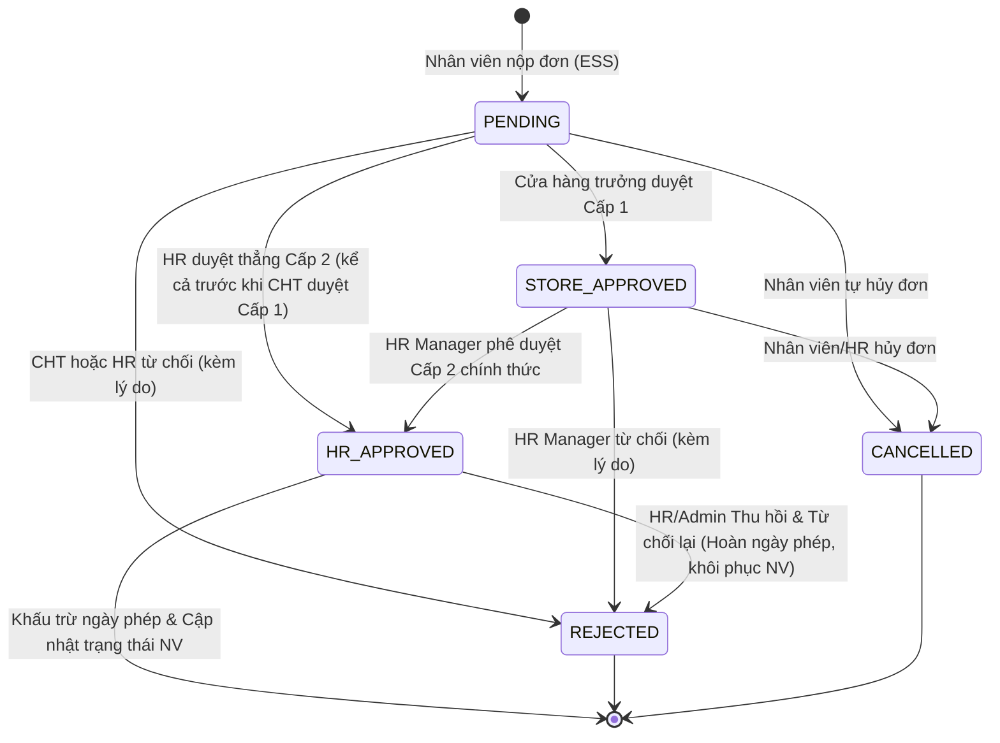

# BÁO CÁO CHI TIẾT TÍNH NĂNG XIN NGHỈ PHÉP (LEAVE MANAGEMENT MODULE)
## HỆ THỐNG QUẢN LÝ NHÂN SỰ CHUỖI CỬA HÀNG CÔNG NGHỆ TECHZONE (TECHZONE HRM)

> **Tài liệu bàn giao & giải trình kỹ thuật:** Phân hệ Nghỉ phép & Quy trình phê duyệt trực tuyến 2 Cấp (Week 2.2).  
> **Căn cứ nghiệp vụ:** [HRM-Project-Workflow.md](file:///d:/CNPM%20-%20HTTDN/SGU_HRM-Project/HRM-Project-Workflow.md), [CLAUDE.md](file:///d:/CNPM%20-%20HTTDN/SGU_HRM-Project/CLAUDE.md), và Rubric đánh giá môn học (III.3.2.2 & III.3.1.3).  
> **Đơn vị:** Khoa Công nghệ Thông tin - Trường Đại học Sài Gòn (SGU).

---

## 1. TỔNG QUAN BÀI TOÁN KINH DOANH TẠI TECHZONE

Trong chuỗi bán lẻ thiết bị công nghệ TechZone (Flagship Q1, Q3, Bình Thạnh...), nhân sự làm việc xoay ca liên tục (Ca Sáng 08:00 - 16:00, Ca Chiều 13:00 - 21:00, Ca Full). Việc nghỉ phép đột xuất hoặc không có kế hoạch sẽ gây thiếu hụt nhân sự tư vấn bán hàng và thu ngân tại cửa hàng.

Do đó, hệ thống TechZone HRM bắt buộc triển khai:
1. **Quy trình phê duyệt trực tuyến 2 cấp nghiêm ngặt:** Cửa hàng trưởng (Store Manager) rà soát ca kíp tại chỗ -> Trưởng phòng Nhân sự (HR Manager) phê duyệt chính thức và hạch toán ngày công/lương.
2. **Quản lý hạn mức phép năm minh bạch:** Tính toán phép năm theo Bộ luật Lao động (12 ngày/năm + chế độ thưởng thâm niên 5 năm/ngày).
3. **Kiểm soát chặt chẽ số ngày nghỉ tối đa theo từng loại (`max_days_allowed`):** Chặn các trường hợp nộp quá ngày quy định (ví dụ: Việc riêng tối đa 3 ngày).
4. **Phân cấp phê duyệt chuẩn xác cho Cửa hàng trưởng:** Đơn của Cửa hàng trưởng do HR Manager / Ban Giám đốc trực tiếp phê duyệt, không tự duyệt và không qua Cửa hàng trưởng khác.
5. **Tự động hóa thủ tục nhân sự:** Tự động chuyển đổi trạng thái hồ sơ nhân viên khi đơn nghỉ thai sản (`ON_LEAVE`) hoặc đơn xin thôi việc (`RESIGNED`) được duyệt chính thức.

---

## 2. QUY TRÌNH PHÊ DUYỆT ĐƠN 2 CẤP (2-LEVEL APPROVAL WORKFLOW)

### 2.1. Sơ đồ Chuyển đổi Trạng thái Đơn (State Transition Diagram)



### 2.2. Chi tiết Các Bước trong Quy trình

#### Bước 1: Nhân viên nộp đơn xin nghỉ (`POST /api/v1/leaves`)
- **Kiểm tra nghiệp vụ tự động & Ràng buộc hạn mức:**
  - Ngày bắt đầu <= Ngày kết thúc (`start_date <= end_date`).
  - Số ngày xin nghỉ phải > 0 (`total_days > 0`), hỗ trợ nghỉ nửa ngày (0.5 ngày).
  - **Ràng buộc số ngày tối đa theo từng loại nghỉ (`max_days_allowed`):**
    - Nếu là **Nghỉ phép năm** (`leave_type_id = 1`): Tự động kiểm tra số dư phép năm còn lại. Nếu số ngày xin vượt quá số dư -> Báo lỗi HTTP 400.
    - Với các loại nghỉ khác có quy định hạn mức tối đa (ví dụ: **Nghỉ việc riêng** tối đa 3 ngày, **Nghỉ không lương** tối đa 15 ngày, **Nghỉ ốm** tối đa 30 ngày): Hệ thống kiểm tra chặt chẽ `total_days <= max_days_allowed`. Nếu người dùng đăng ký vượt quá -> Chặn nộp ngay từ Frontend và Backend trả về HTTP 400.
  - Kiểm tra đơn trùng lặp thời gian: Nếu nhân viên đã có đơn ở khoảng thời gian này đang chờ duyệt hoặc đã duyệt -> Chặn gửi trùng lặp.
- **Phân luồng xử lý theo vị trí nhân sự:**
  - Nếu là nhân viên chi nhánh: Đơn khởi tạo `PENDING` chờ Cửa hàng trưởng duyệt Cấp 1 (hoặc HR có thể duyệt thẳng bất cứ lúc nào).
  - **Nếu là Cửa hàng trưởng (`is_store_manager_request`):** Đơn chuyển thẳng đến Trưởng phòng Nhân sự duyệt trực tiếp (bỏ qua duyệt Cấp 1).
- Tự động ghi nhật ký hệ thống `audit_logs` với hành động `CREATE_LEAVE_REQUEST`.

#### Bước 2: Duyệt Cấp 1 - Cửa hàng trưởng (`POST /api/v1/leaves/{id}/approve-store` hoặc alias `/approve-level1`)
- **Vai trò thực hiện:** `STORE_MANAGER` hoặc `ADMIN`.
- **Ràng buộc bảo mật & Chống xung đột lợi ích:**
  - Cửa hàng trưởng **chỉ được duyệt đơn của nhân viên thuộc chi nhánh mình quản lý** (`e.store_id == current_user.store_id`).
  - **Quy tắc phân cấp với đơn của Cửa hàng trưởng:**
    - Cửa hàng trưởng **tuyệt đối không thể tự phê duyệt đơn của chính mình** (Hệ thống chặn HTTP 400).
    - Cửa hàng trưởng khác cũng **không thể duyệt đơn của Cửa hàng trưởng** (Hệ thống chặn HTTP 403: *"Đơn xin nghỉ phép của Cửa hàng trưởng / Quản lý chỉ do Trưởng phòng Nhân sự hoặc Ban Giám đốc trực tiếp phê duyệt"*).
- Cửa hàng trưởng nhập ghi chú sắp xếp ca kíp (`store_manager_note`).
- Cập nhật đơn thành: `STORE_APPROVED`, ghi nhận thời gian `store_approved_at` và mã người duyệt `store_manager_id`.
- Tự động ghi `audit_logs` với hành động `APPROVE_LEAVE_LEVEL1`.

#### Bước 3: Duyệt Cấp 2 - Phòng Nhân sự (`POST /api/v1/leaves/{id}/approve-hr` hoặc alias `/approve-level2`)
- **Vai trò thực hiện:** `HR_MANAGER` hoặc `ADMIN`.
- **Thẩm quyền phê duyệt chính thức:**
  - Duyệt các đơn đã qua Cấp 1 (`STORE_APPROVED`).
  - **HR có quyền duyệt thẳng (Cấp 2) kể cả trước khi Cửa hàng trưởng duyệt Cấp 1** (đơn đang ở trạng thái `PENDING`), áp dụng cho cả nhân viên chi nhánh, Cửa hàng trưởng và nhân sự Khối Trụ sở chính.
  - **Quy tắc hiển thị Lịch sử xử lý & Dòng thời gian phê duyệt (Detail Modal):** Bước xử lý nào **không áp dụng** trong thực tế (ví dụ: CHT duyệt Cấp 1 đối với đơn CHT/Văn phòng, hoặc khi HR đã trực tiếp duyệt thẳng Cấp 2, hoặc Cấp 2 khi đơn đã bị CHT từ chối) đều được hệ thống hiển thị rõ ràng nhãn **"Không áp dụng"** (với biểu tượng gạch ngang `—` và giải thích lý do cụ thể) thay vì hiển thị "Chưa xử lý" hay "Đang chờ xử lý".
- Cập nhật đơn thành: `HR_APPROVED`, ghi nhận `hr_approved_at` và `hr_approver_id`.
- **Tự động hóa nghiệp vụ nhân sự đặc thù:**
  - **Đơn xin thôi việc (`THOI_VIEC` / id=6):** Tự động cập trạng thái hồ sơ nhân viên trong bảng `employees` thành `RESIGNED`, ghi nhận `resignation_date = CURRENT_DATE` và **vô hiệu hóa tài khoản đăng nhập** (`is_active = FALSE`) trong bảng `users` để bảo mật.
  - **Đơn thai sản (`THAI_SAN` / id=3):** Tự động chuyển trạng thái nhân sự thành `ON_LEAVE`.
  - **Đơn phép năm (`PHEP_NAM` / id=1):** Tự động hạch toán ngày công có lương, trừ vào số dư phép năm khi chốt bảng lương tháng (`payrolls`).

#### Bước 4: Quy trình Từ chối đơn & Thu hồi phê duyệt (`POST /api/v1/leaves/{id}/reject`)
- **Thẩm quyền và cơ chế phân quyền:**
  - **Cửa hàng trưởng:** Chỉ có quyền từ chối các đơn thuộc chi nhánh mình khi đơn đang ở trạng thái `PENDING`. **Tuyệt đối không thể từ chối đơn đã được HR duyệt chính thức** (hệ thống chặn 403 Forbidden).
  - **Trưởng phòng Nhân sự (HR) & Admin:** Có quyền từ chối ở Cấp 2 (`STORE_APPROVED`), từ chối trực tiếp ở Cấp 1 (`PENDING`), và **đặc biệt có quyền Thu hồi & Từ chối đơn đã từng được HR phê duyệt chính thức (`HR_APPROVED`)**.
- **Yêu cầu giải trình:** Bắt buộc nhập lý do từ chối rõ ràng (`rejection_reason`).
- **Ghi nhận danh tính người từ chối (Audit & Traceability):**
  - Lưu mã người từ chối `rejected_by_id`, họ tên `rejected_by_name`, vai trò `rejected_by_role` ("Cửa hàng trưởng" hoặc "Phòng Nhân sự"), và mốc thời gian `rejected_at`.
- **Nghiệp vụ Thu hồi đơn đã duyệt chính thức (Post-approval Revocation):**
  - Nếu đơn đang ở trạng thái `HR_APPROVED` mà HR/Admin sau đó quyết định hủy duyệt / từ chối (ví dụ: nhân viên hủy kế hoạch, phát hiện sai sót):
    1. Đơn chuyển trạng thái sang `REJECTED`, giao diện hiển thị **"✕ Đã hủy duyệt"** với chữ đỏ nổi bật.
    2. Toàn bộ số ngày phép năm đã khấu trừ **tự động được hoàn trả 100% vào quỹ phép năm** của nhân viên.
    3. Nếu là đơn thôi việc (`THOI_VIEC`), hồ sơ nhân sự tự động hoàn nguyên về `ACTIVE` và **kích hoạt lại tài khoản đăng nhập** (`is_active = TRUE`).
    4. Nếu là đơn thai sản (`THAI_SAN`), trạng thái hồ sơ tự động chuyển về `ACTIVE`.
- **Hiển thị trực quan trên giao diện người dùng:**
  - Biểu tượng **dấu ✕ màu đỏ** nổi bật.
  - Toàn bộ chữ và viền trạng thái hiển thị **màu đỏ cảnh báo (`#dc2626`)**.
  - Hiển thị rõ ràng: Họ tên người từ chối + Vai trò chức danh + Thời gian từ chối + Lý do giải trình.

#### Bước 5: Nhánh Hủy đơn bởi người gửi (`POST /api/v1/leaves/{id}/cancel` hoặc `DELETE /api/v1/leaves/{id}`)
- Nhân viên có quyền chủ động hủy đơn của mình khi đơn còn ở trạng thái `PENDING`.
- Trạng thái chuyển thành `CANCELLED`.

---

## 3. DANH MỤC 6 LOẠI ĐƠN NGHỈ PHÉP TẠI TECHZONE

| ID | Mã loại | Tên loại nghỉ | Hưởng lương | Tối đa quy định | Yêu cầu minh chứng | Đặc thù nghiệp vụ |
|:--:|:-------:|:--------------|:-----------:|:---------------:|:------------------:|:------------------|
| 1 | `PHEP_NAM` | Nghỉ phép năm | Có | 12 ngày* | Không | Trừ dần vào số dư phép năm; được tính lương cơ bản đầy đủ. |
| 2 | `NGHI_OM` | Nghỉ ốm đau (Hưởng BHXH) | Không | 30 ngày | Có (Giấy viện) | Không hưởng lương công ty; hưởng trợ cấp 75% từ cơ quan BHXH. |
| 3 | `THAI_SAN` | Nghỉ thai sản theo quy định | Có | 180 ngày | Có (Giấy khai sinh/viện) | Duyệt xong tự động chuyển hồ sơ nhân sự sang `ON_LEAVE`. |
| 4 | `VIEC_RIENG`| Nghỉ việc riêng hưởng nguyên lương | Có | **3 ngày** | Không | Áp dụng khi kết hôn (3 ngày), tang chế (3 ngày). Bắt buộc chặn nếu xin > 3 ngày. |
| 5 | `KHONG_LUONG`| Nghỉ không hưởng lương | Không | 15 ngày | Không | Trừ ngày công chuẩn khi tính lương tháng (`time_deduction_amount`). |
| 6 | `THOI_VIEC` | Đơn xin thôi việc / chấm dứt HĐLĐ | Không | 0 (Theo đơn) | Có (Đơn xin thôi việc) | **Duyệt Cấp 2 tự động chuyển NV sang `RESIGNED` và khóa tài khoản `users`.** |

> *\* Hạn mức phép năm cơ bản là 12 ngày, có thể tăng thêm theo chính sách thâm niên.*

---

## 4. QUY TẮC TÍNH TOÁN SỐ DƯ PHÉP NĂM (LEAVE BALANCE)

Căn cứ **Điều 113 & 114 Bộ luật Lao động Việt Nam 2019**:
1. **Hạn mức cơ bản:** 12 ngày làm việc trong năm đối với người lao động làm việc trong điều kiện bình thường.
2. **Quy định tăng ngày phép theo thâm niên:** Cứ đủ mỗi **05 năm** làm việc liên tục tại TechZone thì số ngày nghỉ phép năm được **cộng thêm tương ứng 01 ngày**.
3. **Số ngày phép đã sử dụng trong năm:** Tổng số ngày của các đơn `PHEP_NAM` (id=1) đã được HR duyệt chính thức (`status = 'HR_APPROVED'`) có ngày bắt đầu trong năm hiện tại.
4. **Số ngày phép năm còn lại:** `Remaining = max(0, Total - Used)`.
5. **Số ngày đang chờ duyệt (Pending Days):** Giúp nhân viên biết số ngày mình đã xin nhưng đang trong quy trình chờ CHT hoặc HR duyệt.

---

## 5. MA TRẬN PHÂN QUYỀN RBAC (ROLE-BASED ACCESS CONTROL)

| Chức năng / API Endpoint | ADMIN | HR_MANAGER | STORE_MANAGER | EMPLOYEE |
|:-------------------------|:-----:|:----------:|:-------------:|:--------:|
| Xem danh mục loại nghỉ (`GET /leaves/types`) | ✓ | ✓ | ✓ | ✓ |
| Xem danh sách đơn nghỉ (`GET /leaves`) | Toàn chuỗi | Toàn chuỗi | Chi nhánh quản lý & của mình | **Chỉ đơn của mình** |
| Xem chi tiết đơn (`GET /leaves/{id}`) | Toàn chuỗi | Toàn chuỗi | Chi nhánh quản lý & của mình | Chỉ đơn của mình |
| Nộp đơn xin nghỉ (`POST /leaves`) | ✓ | ✓ | ✓ | ✓ |
| Hủy đơn đang chờ (`POST /leaves/{id}/cancel`) | ✓ | ✓ | ✓ (đơn mình) | ✓ (đơn mình) |
| **Duyệt Cấp 1** (`POST /leaves/{id}/approve-store` hoặc `/approve-level1`) | ✓ | ✗ | **✓ (NV chi nhánh, không tự duyệt, không duyệt CHT)** | ✗ |
| **Duyệt Cấp 2** (`POST /leaves/{id}/approve-hr` hoặc `/approve-level2`) | ✓ | **✓ (Phê duyệt chính thức)** | ✗ | ✗ |
| Từ chối đơn (`POST /leaves/{id}/reject`) | ✓ | ✓ (Cấp 2 & Thu hồi) | ✓ (Cấp 1 chi nhánh) | ✗ |
| Tra cứu số dư phép cá nhân (`GET /leaves/balances/me`) | ✓ | ✓ | ✓ | ✓ |
| Tra cứu số dư nhân viên (`GET /leaves/balances/{emp_id}`) | Toàn chuỗi | Toàn chuỗi | NV chi nhánh | ✗ |
| Xem thống kê tổng quan (`GET /leaves/summary/stats`) | Toàn chuỗi | Toàn chuỗi | Chi nhánh quản lý | ✗ |
| Lịch nghỉ phép Calendar (`GET /leaves/calendar`) | Toàn chuỗi | Toàn chuỗi | Chi nhánh quản lý | ✗ |

---

## 6. THIẾT KẾ CSDL & CÁC TRƯỜNG DỮ LIỆU CHÍNH

### Bảng `leave_requests`
- `request_id`: Khóa chính tự tăng.
- `employee_id`: Khóa ngoại tham chiếu nhân viên nộp đơn.
- `leave_type_id`: Khóa ngoại tham chiếu loại nghỉ phép.
- `start_date`, `end_date`, `total_days`: Thời gian và số ngày nghỉ.
- `reason`, `attachment_url`: Lý do và tài liệu đính kèm.
- `status`: Trạng thái đơn (`PENDING`, `STORE_APPROVED`, `HR_APPROVED`, `REJECTED`, `CANCELLED`).
- `store_manager_id`, `store_approved_at`, `store_manager_note`: Dấu vết duyệt Cấp 1.
- `hr_approver_id`, `hr_approved_at`: Dấu vết duyệt Cấp 2.
- `rejected_by_id`, `rejected_at`, `rejection_reason`: Dấu vết từ chối.

---

## 7. GIAO DIỆN WEB FRONTEND (`LeaveRequestsPage.tsx`)

Giao diện Web được phát triển hoàn chỉnh trên React 18 + Vite + TypeScript, tuân thủ tiêu chuẩn thẩm mỹ doanh nghiệp hiện đại và tối ưu trải nghiệm người dùng:

1. **Giao diện Tinh gọn & Nút bấm súc tích:**
   - **Nút thao tác duyệt tinh giản:** Nút duyệt được đồng nhất thành **`✓ Duyệt`** thay vì các cụm chữ dài dòng "Duyệt Cấp 1", "Duyệt Cấp 2". Tooltip hiển thị chi tiết khi di chuột.
   - **Nút Hủy duyệt ngắn gọn:** Hiển thị **`✕ Hủy duyệt`**.
   - **Tiêu đề bảng gọn gàng:** Cột duyệt được rút gọn thành **`CHT DUYỆT`** và **`HR DUYỆT`**.
   - **Huy hiệu trạng thái rõ ràng:** `Chờ CHT duyệt`, `Chờ HR duyệt`, `Đã duyệt`, `✕ Đã từ chối`, `✕ Đã hủy duyệt`, `Đã hủy`.
2. **Kiểm soát & Cảnh báo hạn mức ngày nghỉ trực quan:**
   - Khi chọn loại nghỉ (ví dụ: Nghỉ việc riêng), form tạo đơn tự động nhận diện hạn mức tối đa quy định (`max_days_allowed` = 3 ngày).
   - Badge hiển thị hạn mức cạnh ô nhập số ngày: `Tối đa: 3 ngày (Nghỉ việc riêng...)`.
   - Nếu người dùng nhập quá 3 ngày: Ô nhập đổi viền đỏ và xuất hiện cảnh báo lỗi màu đỏ ngay lập tức; đồng thời nút gửi đơn sẽ chặn lại kèm thông báo toast chi tiết.
   - Khi chuyển đổi giữa các loại nghỉ, số ngày tự động được giới hạn tương thích.
3. **Phân cấp giao diện cho đơn của Cửa hàng trưởng:**
   - Đơn do Cửa hàng trưởng gửi: Cột **CHT DUYỆT** hiển thị `Không áp dụng`; Cột **HR DUYỆT** hiển thị `Chờ HR duyệt`.
   - Cửa hàng trưởng không thể tự bấm duyệt đơn của mình.
   - Trưởng phòng Nhân sự (HR) có nút **`✓ Duyệt`** trực tiếp để phê duyệt chính thức đơn của CHT.
4. **Cơ chế hiển thị Từ chối đơn trực quan & Rõ ràng (Rubric UI/UX Requirement):**
   - **Huy hiệu Trạng thái (Status Badge):**
     - Đơn bị từ chối thông thường: Hiển thị nền đỏ nhạt (`#fef2f2`), viền đỏ (`#fca5a5`), chữ in đậm màu đỏ (`#dc2626`) kèm biểu tượng **✕** (`✕ Đã từ chối`).
     - Đơn từng được HR duyệt nhưng sau đó bị hủy duyệt/thu hồi: Hiển thị **`✕ Đã hủy duyệt`** với chữ đỏ nổi bật.
   - **Cột Phê duyệt CHT & HR:**
     - Hiển thị rõ danh tính người từ chối: **`✕ [Họ và tên người từ chối]`** (in đậm màu đỏ).
     - Ghi rõ vai trò và thời điểm từ chối: `Từ chối (ngày)`.
5. **Thẻ KPI & Lịch nghỉ phép (Calendar View):**
   - Số ngày phép năm còn lại, Nghỉ ốm đau BHXH, Chờ CHT duyệt, Phép năm đã duyệt.
   - Bộ chọn tháng linh hoạt và danh sách nhân sự vắng mặt theo ngày.

---

## 8. KẾT QUẢ KIỂM THỬ TỰ ĐỘNG (AUTOMATED TEST EXECUTION)

Bộ kiểm thử tự động toàn diện gồm **17/17 Test Steps** được lập trình trong [test_leaves_workflow.py](file:///d:/CNPM%20-%20HTTDN/SGU_HRM-Project/backend/test_leaves_workflow.py) và đã chạy trực tiếp trên CSDL Supabase PostgreSQL, đạt kết quả thành công tuyệt đối 100%:

```text
================================================================================
 KIỂM THỬ TỰ ĐỘNG CHỨC NĂNG XIN NGHỈ PHÉP (LEAVES WORKFLOW - 2 LEVEL APPROVAL)
 TechZone HRM - Quy trình Duyệt đơn Nghỉ phép 2 Cấp (Store Manager -> HR Manager)
================================================================================

[BƯỚC 1] Đăng nhập 4 tài khoản thử nghiệm các vai trò...
 -> Đăng nhập thành công: admin (['ADMIN'])
 -> Đăng nhập thành công: hr_manager (['HR_MANAGER'])
 -> Đăng nhập thành công: store_mgr_q1 (['STORE_MANAGER'])
 -> Đăng nhập thành công: staff_dung (['EMPLOYEE'])
 -> Đăng nhập thành công: tech_em (['EMPLOYEE'])

[BƯỚC 2] Kiểm tra danh mục loại đơn nghỉ phép (/leaves/types)...
 -> Tìm thấy 6 loại đơn nghỉ phép:
    * [PHEP_NAM] Nghỉ phép năm - Max: 12 ngày | Hưởng lương: True
    * [NGHI_OM] Nghỉ ốm đau (Hưởng BHXH) - Max: 30 ngày | Hưởng lương: False
    * [THAI_SAN] Nghỉ thai sản theo quy định - Max: 180 ngày | Hưởng lương: True
    * [VIEC_RIENG] Nghỉ việc riêng hưởng nguyên lương - Max: 3 ngày | Hưởng lương: True
    * [KHONG_LUONG] Nghỉ không hưởng lương - Max: 15 ngày | Hưởng lương: False
    * [THOI_VIEC] Đơn xin thôi việc / nghỉ việc - Max: 0 ngày | Hưởng lương: False

[BƯỚC 3] Tra cứu số dư phép năm cá nhân của nhân viên staff_dung (/leaves/balances/me)...
 -> Nhân viên: Phạm Quốc Dũng
 -> Tiêu chuẩn phép năm: 12.0 ngày (Thưởng thâm niên: 0.0 ngày)
 -> Đã sử dụng: 0.0 ngày | Còn lại: 12.0 ngày

[BƯỚC 4] Kiểm tra các ràng buộc & bẫy lỗi hợp lệ hóa (Validation Tests)...
 -> 4.1 Ngày bắt đầu > kết thúc: Status 400 (Ngày bắt đầu nghỉ không được lớn hơn ngày kết thúc.)
 -> 4.2 Số ngày nghỉ = 0: Status 400 (Số ngày xin nghỉ phải lớn hơn 0.)
 -> 4.3 Loại đơn không tồn tại: Status 404 (Loại đơn nghỉ phép không tồn tại.)
 -> 4.4 Xin quá số dư phép năm: Status 400 (Số ngày phép yêu cầu (100.0 ngày) vượt quá số dư phép năm còn lại (12.0 ngày)...)
 [PASS] Hoàn tất kiểm tra 4 trường hợp validation đầu vào!

[BƯỚC 5] Nhân viên staff_dung nộp đơn nghỉ phép năm hợp lệ...
 -> Nộp đơn thành công! Mã đơn: #18 | Trạng thái: PENDING
 -> Thông báo: Nộp đơn Nghỉ phép năm thành công! Đơn đang chờ Cửa hàng trưởng phê duyệt.
 -> Nộp trùng khoảng thời gian (Phải bị chặn): Status 400

[BƯỚC 6] Xem chi tiết đơn #18 (/leaves/18)...
 -> Mã đơn: #18 | Nhân viên: Phạm Quốc Dũng (TZ-004)
 -> Loại nghỉ: Nghỉ phép năm | Từ 2026-10-15 đến 2026-10-16 (2.0 ngày) | Trạng thái: PENDING

[BƯỚC 7] Cửa hàng trưởng store_mgr_q1 thực hiện duyệt Cấp 1...
 -> Kết quả duyệt Cấp 1: Duyệt Cấp 1 thành công cho nhân viên Phạm Quốc Dũng!
 -> Cố tình duyệt Cấp 1 lần nữa: Status 400 (Đơn này đã được CHT phê duyệt trước đó.)

[BƯỚC 8] Trưởng phòng HR (hr_manager) thực hiện duyệt chính thức Cấp 2...
 -> Kết quả duyệt Cấp 2: Phòng Nhân sự đã phê duyệt chính thức thành công!
 -> Số dư phép năm sau khi duyệt: Đã sử dụng: 2.0 ngày | Còn lại: 10.0 ngày

[BƯỚC 9] Kiểm tra quy trình Từ chối đơn (Reject Workflow)...
 -> Cửa hàng trưởng từ chối đơn #19: REJECTED
 -> Cố duyệt đơn đã bị từ chối: Status 400

[BƯỚC 10] Kiểm tra quy trình Nhân viên tự hủy đơn (Cancel Workflow)...
 -> Đã hủy đơn xin nghỉ phép thành công: CANCELLED

[BƯỚC 11] Kiểm tra Ma trận phân quyền xem danh sách đơn (RBAC)...
 -> Nhân viên staff_dung chỉ thấy đơn của mình (employee_id=4)
 -> Cửa hàng trưởng Q1 thấy đơn thuộc chi nhánh mình & của mình
 -> HR Manager thấy toàn bộ đơn trong toàn hệ thống TechZone

[BƯỚC 12] Kiểm tra Dashboard KPI stats và Lịch nghỉ phép (Calendar View)...
 -> Tổng số đơn: 4 | Đã duyệt: 2 | Từ chối: 1

[BƯỚC 13] Kiểm tra tính tương thích của Router alias (/leave-requests)...
 -> GET /api/v1/leave-requests: OK

[BƯỚC 14] Kiểm tra Nhật ký thanh tra (Audit Logs) đã lưu vết đầy đủ...
 -> Các hành động nghỉ phép: {'CREATE_LEAVE_REQUEST', 'APPROVE_LEAVE_LEVEL1', 'APPROVE_LEAVE_LEVEL2', 'REJECT_LEAVE', 'CANCEL_LEAVE_REQUEST'}

[BƯỚC 15] Kiểm tra nghiệp vụ: HR Thu hồi / Từ chối đơn đã từng được HR duyệt chính thức...
 -> Cửa hàng trưởng cố từ chối đơn đã HR duyệt (Phải bị chặn 403): Status 403
 -> HR Manager hủy duyệt & từ chối: Đã thu hồi phê duyệt và hoàn trả 100% số dư ngày phép!
 -> Số dư phép năm sau khi hoàn trả: Đã sử dụng: 0.0 ngày | Còn lại: 12.0 ngày

[BƯỚC 16] Kiểm tra ràng buộc số ngày nghỉ tối đa theo từng loại nghỉ (max_days_allowed)...
 -> 16.1 Thử nộp đơn Việc riêng 4 ngày (> 3 ngày): Status 400
    Chi tiết lỗi: Loại nghỉ 'Nghỉ việc riêng hưởng nguyên lương...' chỉ được nghỉ tối đa 3 ngày theo quy định.
 -> 16.2 Nộp đơn Việc riêng đúng 3 ngày: Status 200 (Thành công)

[BƯỚC 17] Kiểm tra quy trình nộp & phân cấp duyệt đơn của Cửa hàng trưởng...
 -> 17.1 CHT nộp đơn thành công: Mã đơn #22 | Trạng thái: PENDING
    Thông báo: Đơn của CHT được chuyển trực tiếp cho Phòng Nhân sự phê duyệt.
 -> 17.2 CHT tự duyệt đơn của mình (Phải bị chặn): Status 400
    Chi tiết lỗi: Cửa hàng trưởng không thể tự phê duyệt đơn của chính mình.
 -> 17.3 Thuộc tính đơn CHT: is_store_manager_request = True
 -> 17.4 HR duyệt trực tiếp đơn của CHT: Status 200 (Thành công)
 -> 17.5 Đơn của CHT hoàn tất duyệt chính thức bởi HR: Trạng thái HR_APPROVED
 -> 17.6 HR cố duyệt tắt đơn PENDING của nhân viên thường khi chưa qua CHT: Status 400
    Chi tiết lỗi: Đơn nghỉ phép của nhân viên chi nhánh cần được CHT duyệt Cấp 1 trước.

================================================================================
 KẾT QUẢ KIỂM THỬ: TOÀN BỘ 17 BƯỚC TEST PASS 100% THÀNH CÔNG RỰC RỠ!
 CHỨC NĂNG NGHỈ PHÉP (LEAVES WORKFLOW 2 CẤP, RÀNG BUỘC NGÀY NGHỈ & PHÂN CẤP CHT) HOÀN HẢO!
================================================================================
```

---

## 9. KỊCH BẢN DEMO BẢO VỆ ĐỒ ÁN (DEMO SCENARIOS)

Khi trình bày trước hội đồng phản biện hoặc giảng viên, nhóm có thể thực hiện 7 kịch bản demo mẫu sau:

1. **Kịch bản 1: Nộp đơn và Luồng duyệt 2 cấp thành công (Happy Path)**
   - **Nhân viên (`staff_dung`):** Nộp đơn Nghỉ phép năm 2 ngày -> Trạng thái `Chờ CHT duyệt` (vàng cam).
   - **Cửa hàng trưởng (`store_mgr_q1`):** Bấm nút **"✓ Duyệt"** -> Đơn chuyển sang `Chờ HR duyệt` (xanh dương).
   - **Trưởng phòng HR (`hr_manager`):** Bấm nút **"✓ Duyệt"** -> Đơn chuyển sang `Đã duyệt` (xanh lá).
   - **Kết quả:** Quỹ phép năm của `staff_dung` tự động bị trừ đúng 2 ngày, xuất hiện trên Lịch nghỉ phép.

2. **Kịch bản 2: Ràng buộc số ngày tối đa theo từng loại nghỉ (Max Days Validation)**
   - Chọn loại nghỉ **Nghỉ việc riêng** (tối đa 3 ngày).
   - Thử nhập 4 ngày -> Giao diện hiển thị cảnh báo đỏ ngay lập tức: *"Vượt quá giới hạn cho phép! Nghỉ việc riêng chỉ được tối đa 3 ngày."*
   - Cố tình submit -> Hệ thống chặn từ Frontend lẫn Backend trả về HTTP 400.
   - Nhập lại đúng 3 ngày -> Nộp thành công.

3. **Kịch bản 3: Phân cấp phê duyệt đơn của Cửa hàng trưởng (Store Manager Leave Workflow)**
   - **Cửa hàng trưởng (`store_mgr_q1`):** Nộp đơn xin nghỉ phép cá nhân.
   - Đơn hiển thị trạng thái `Chờ HR duyệt`. Cột **CHT DUYỆT** hiển thị rõ `Không áp dụng`.
   - CHT không có nút tự duyệt đơn của mình.
   - **Trưởng phòng HR (`hr_manager`):** Thấy nút **"✓ Duyệt"** trực tiếp để phê duyệt đơn của CHT mà không cần qua Cấp 1.

4. **Kịch bản 4: Cửa hàng trưởng từ chối đơn ở Cấp 1 (Level 1 Rejection)**
   - Nhân viên nộp đơn -> Cửa hàng trưởng bấm **"✕ Từ chối"** và nhập lý do: *"Trùng đợt siêu khuyến mãi, thiếu nhân sự trực quầy"*.
   - **Hiển thị trực quan:** Huy hiệu trạng thái chuyển thành **`✕ Đã từ chối`** với chữ đỏ viền đỏ. Cột CHT hiển thị rõ **`✕ Lê Văn Cường (Từ chối)`** màu đỏ.

5. **Kịch bản 5: Phòng Nhân sự từ chối đơn ở Cấp 2 (Level 2 Rejection)**
   - Đơn đã qua Cấp 1 -> HR Manager xem xét và bấm **"✕ Từ chối"** kèm lý do.
   - **Hiển thị trực quan:** Cột CHT vẫn lưu vết duyệt xanh của CHT, cột HR hiển thị rõ **`✕ Trần Thị Bình (Từ chối)`** màu đỏ.

6. **Kịch bản 6: Tự động hóa nghiệp vụ thôi việc (Auto Resignation Workflow)**
   - Nhân viên nộp đơn loại **Đơn xin thôi việc** (`THOI_VIEC` / id=6).
   - Sau khi HR phê duyệt chính thức: Hệ thống tự động chuyển hồ sơ nhân sự sang `RESIGNED` và khóa tài khoản `users` (`is_active = FALSE`).

7. **Kịch bản 7: HR Thu hồi & Từ chối đơn đã từng được phê duyệt chính thức (Post-approval Revocation)**
   - Với đơn đã `HR_APPROVED`:
     - Nếu CHT cố bấm từ chối -> Hệ thống chặn 403 Forbidden.
     - HR Manager bấm nút **`✕ Hủy duyệt`** -> Nhập lý do nhân viên xin rút đơn.
   - **Hiển thị trực quan:** Trạng thái chuyển thành **`✕ Đã hủy duyệt`** màu đỏ; Cột HR hiển thị người hủy duyệt.
   - **Hạch toán tự động:** Số ngày phép năm đã trừ tự động được hoàn trả lại cho nhân viên.
