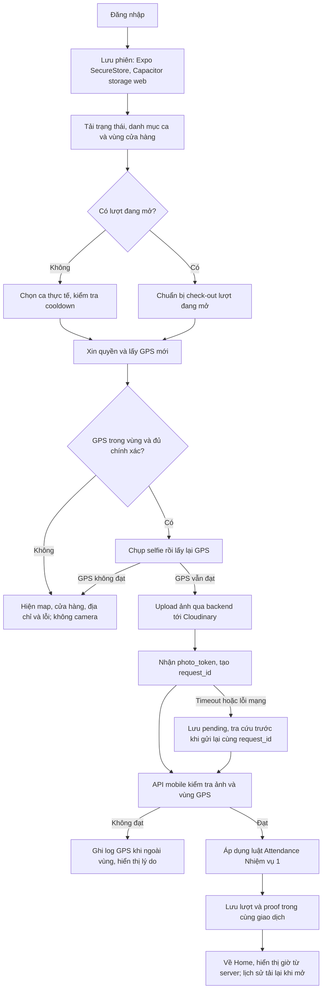
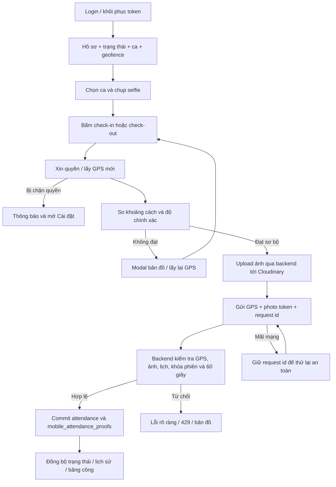
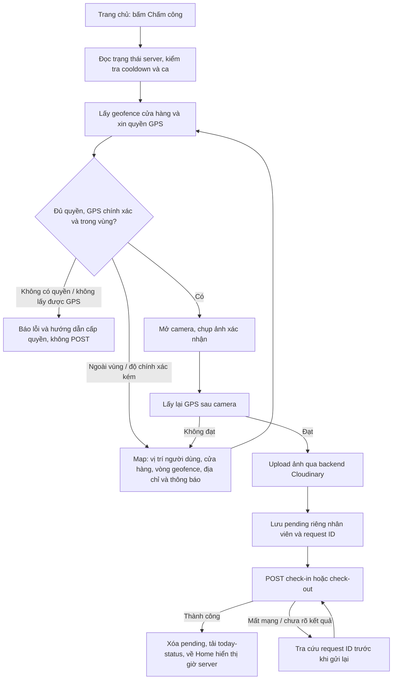

# TECHZONE HRM — NHIỆM VỤ 2: ATTENDANCE MOBILE

> **Phụ trách:** Đoàn Trung Kiên — MSSV 3123411166  
> **Ngày cập nhật:** 04/10/2026  
> **Nền tảng:** React/Vite + Capacitor 8 → Android Emulator; tiếp tục duy trì Expo SDK 57 trong `mobile/`.  
> **Tiến độ nghiệm thu:** **90%** — APK đã build/cài/chạy trên emulator; GPS native ngoài vùng và map đã kiểm tra. Còn upload Cloudinary và toàn bộ vòng check-in/check-out/proof với backend thật. Theo yêu cầu mới, **không yêu cầu điện thoại thật**.  
> **Hướng dẫn chạy:** [Android Studio / Emulator từng bước](../ANDROID_EMULATOR_GUIDE.md). Kết quả mới nhất ở **mục 12**; mục 4–11 lưu lịch sử các đợt trước.
> **Tham chiếu:** `mission1.md`, `TECHZONE_HRM_ATTENDANCE_MANAGEMENT.md`, `Markdown-Live-Preview.pdf`.

## 1. Phạm vi và cách tính tiến độ

Tiến độ là thang điểm công việc có trọng số, không phải tỷ lệ test pass hay lời khẳng định đã chạy end-to-end với provider thật.

| Hạng mục | Trọng số | Đã đạt | Bằng chứng |
|---|---:|---:|---|
| Check-in mobile | 15 | 15 | Chọn ca → GPS hợp lệ → selfie → API addon → hiển thị kết quả/bất thường |
| Check-out mobile | 15 | 15 | Backend tự tìm lượt mở, gồm ca qua đêm; cập nhật trạng thái và đếm ngược |
| Attendance History | 15 | 15 | Danh sách từng lượt, lọc tháng Việt Nam, giờ vào/ra, số liệu độc lập, trạng thái lỗi/rỗng |
| Kết nối API và phiên đăng nhập | 15 | 15 | Bearer token, 401, timeout, chống gửi trùng; Expo dùng SecureStore, Capacitor kế thừa storage của web |
| Kiểm thử tự động và build | 20 | 20 | 39 test backend, 21 test mobile, PostgreSQL integration, lint/typecheck, Android bundle, UI browser có fixture |
| Cấu hình Track Asia + Cloudinary + vùng cửa hàng thật | 10 | 6 | Track Asia 2/2; geofence 4/4 đã ghi/đọc lại DB; Cloudinary 0/4 vì kiểm tra tài khoản 401, chưa upload thật |

## 2. Luật nghiệp vụ kế thừa Nhiệm vụ 1

- Một nhân viên có nhiều lượt trong ngày; chỉ một lượt mở tại một thời điểm.
- Check-out xong phải chờ ít nhất 60 giây mới được check-in lại. Đồng hồ máy chủ quyết định; đếm ngược mobile chỉ hỗ trợ giao diện.
- Bổ sung theo yêu cầu 02/10: mỗi lượt phải kéo dài tối thiểu 60 giây trước check-out; 429 và Retry-After khi chưa đủ thời gian.
- Giờ công, ngày nghiệp vụ, ca qua đêm và ân hạn theo từng ca được backend xử lý bằng UTC+07.
- Chưa có lịch: UNSCHEDULED; khác ca/cửa hàng phân công: SHIFT_MISMATCH; không âm thầm chặn thay cho quy tắc đã chốt.
- Bản chụp ca được giữ; sửa lịch sau đó không làm thay đổi lượt cũ.
- late_minutes, early_minutes, overtime_hours hiển thị riêng; status chỉ là nhãn tóm tắt.
- Mobile chỉ thao tác nhân viên gắn với token, không gửi employee_id để chấm công hộ.

## 3. Phần GPS và ảnh theo tài liệu PDF

### 3.1. Phân công công nghệ

| Thành phần | Công cụ | Cách sử dụng |
|---|---|---|
| Bản đồ | Track Asia | TrackAsia GL JS trong WebView; đánh dấu cửa hàng và vị trí vừa lấy; style sáng/tối |
| Lấy tọa độ | expo-location | Xin quyền foreground, lấy vị trí mới khi gửi chấm công, không theo dõi nền |
| Camera | expo-image-picker | Mở camera trước để chụp mới; không có nút chọn ảnh thư viện |
| Lưu ảnh | Cloudinary | Mobile gửi JPEG tới backend; backend ký và upload, secret không nằm trong app |
| Phiên đăng nhập | expo-secure-store | Lưu token trong kho native; web preview chỉ lưu phiên trong bộ nhớ |
| Chạy thử | Expo Go | Mở dự án bằng bản Expo Go tương thích SDK 57 |
Cloudinary là nơi lưu ảnh, không phải thư viện camera. Track Asia hiển thị bản đồ, không quyết định quyền chấm công.

### 3.2. Kiểm tra tại backend

1. Xác thực tài khoản và khóa hàng nhân viên.
2. Kiểm tra request_id đã xử lý để trả lại kết quả cũ nếu client thử lại.
3. Xác minh photo_token có chữ ký, đúng nhân viên, đúng audience, chưa hết 10 phút và nonce chưa dùng.
4. Kiểm tra tọa độ hợp lệ, độ chính xác GPS >0 và <=100m; thời điểm vị trí có timezone và không quá 120 giây (cho phép lệch tương lai tối đa 15 giây).
5. Đọc vùng cửa hàng đã cấu hình và đang bật. Thiếu cấu hình thì chặn, không dùng tọa độ giả hoặc mặc định một cửa hàng khác.
6. Tính khoảng cách Haversine trên máy chủ. Chỉ chấp nhận khoảng cách <= bán kính; độ chính xác còn phải <= bán kính.
7. Ngoài vùng: ghi proof REJECTED_GPS_OUT_OF_RANGE, attendance_id null, trả 422; không mở/đóng lượt.
8. Hợp lệ: gọi logic Nhiệm vụ 1; ghi proof SUCCESS và attendance trong cùng giao dịch rồi mới commit.

GPS vẫn là dữ liệu thiết bị cung cấp. Chữ ký token ảnh chứng minh backend đã nhận ảnh qua Cloudinary, không chứng minh người trong ảnh là chủ tài khoản hoặc ảnh không bị dựng. Không có AI nhận diện/liveness hoặc cơ chế attestation chống giả GPS.

**Phạm vi bắt buộc:** camera/GPS bắt buộc tại các endpoint `/mobile-attendance/*`. Các endpoint Attendance truyền thống của Web vẫn giữ hợp đồng Nhiệm vụ 1. Vì cùng tài khoản còn có thể dùng các API cũ, chưa thể tuyên bố toàn hệ thống không có đường bỏ qua GPS. Nếu cần bắt buộc cho mọi kênh, phải thống nhất chính sách Web/Kiosk và áp dụng ở luồng lõi trong một thay đổi riêng.

### 3.3. Addon độc lập

Migration `backend/migrations/20261001_mobile_attendance.sql` tạo hai bảng mới, không sửa cấu trúc các bảng nghiệp vụ hiện có:

- `mobile_store_geofences`: tọa độ tâm, bán kính (mặc định 150m), trạng thái kích hoạt theo store_id.
- `mobile_attendance_proofs`: request_id, employee/store/attendance, loại thao tác, tọa độ, sai số, khoảng cách, bán kính, URL ảnh, nonce, trạng thái, kết quả JSON và thời điểm ghi.

Tên có tiền tố mobile để tránh xung đột với addon khác. Không tự nạp tọa độ “mẫu” thành tọa độ cửa hàng thật. Migration đã áp dụng thành công trong môi trường hiện tại.

## 4. Luồng xử lý



### Những cải tiến quy trình đã thực hiện

- Khóa nút ngay khi gửi để hạn chế bấm liên tiếp.
- Request idempotency: phản hồi bị mất có thể gửi lại cùng request_id mà không tạo lượt thứ hai; không tự động gửi lại với ID mới.
- Lưu proof cùng giao dịch lượt chấm công; lỗi cooldown/ca/quyền không để lại proof thành công giả.
- Ảnh có nonce dùng một lần, token hết hạn và ràng buộc chủ tài khoản.
- Khi app quay lại foreground hoặc màn hình được focus, tải lại trạng thái; định kỳ 30 giây khi đang hoạt động.
- Lỗi mạng/401/422/429 được hiển thị rõ; không chuyển thành “không có lịch sử”.
- Lịch sử dùng FlatList, không gộp các lượt thành một bản ghi/ngày; request cũ không ghi đè kết quả lọc tháng mới.
- Giao diện dùng màu theo dark/light, vùng chạm lớn và nội dung tiếng Việt.

Pending đã lưu riêng theo nhân viên qua lần mở lại app: Expo dùng SecureStore, Capacitor dùng localStorage. Phải tra cứu kết quả cũ trước khi thử lại; không có offline queue cho lượt chấm công mới vì thời gian/GPS cần xác minh trực tiếp.

## 5. Hợp đồng API

Base URL: Expo dùng `EXPO_PUBLIC_API_URL`; React/Capacitor dùng `VITE_API_URL`. Giá trị cho Android emulator là `http://10.0.2.2:8000/api/v1`.

| Method | Endpoint | Chức năng |
|---|---|---|
| POST | /auth/login | JSON username/password, nhận access_token |
| GET | /attendances/shifts | Danh mục ca hợp lệ |
| GET | /attendances/today-status | Lượt mở/khoảng chờ/đối chiếu lịch |
| GET | /attendances/my-history?period=YYYY-MM | Lịch sử của chính nhân viên |
| GET | /mobile-attendance/geofence | Vùng cửa hàng; khi có lượt mở dùng cửa hàng của lượt đó |
| POST | /mobile-attendance/photo | Multipart file JPEG <=5MB; trả photo_token, photo_url, expires_in |
| POST | /mobile-attendance/check-in | Ghi nhận vào ca có GPS/ảnh; 201 |
| POST | /mobile-attendance/check-out | Đóng lượt mở có GPS/ảnh; 200 |

Ví dụ body gửi vào/ra (các giá trị dưới đây chỉ minh họa, không phải vùng cửa hàng thật):

```json
{
  "request_id": "f08bb2dd-f130-4f54-b042-0c681659623e",
  "photo_token": "<token trả về từ /mobile-attendance/photo>",
  "latitude": 10.7743,
  "longitude": 106.7025,
  "accuracy_meters": 10,
  "captured_at": "2026-10-01T08:00:00+07:00",
  "shift_id": 1
}
```

Không nhận employee_id hoặc URL ảnh tùy ý trong request chấm công. Check-out tự tìm lượt mở; shift_id không thay thế ca của lượt đang mở.

| Lỗi | Xử lý mobile |
|---|---|
| 401 | Xóa phiên và yêu cầu đăng nhập lại |
| 409 | Hiển thị xung đột/lượt mở/thiếu vùng cấu hình; tải lại trạng thái |
| 422 | GPS hoặc ảnh không hợp lệ; lấy vị trí/chụp ảnh mới |
| 429 | Dùng Retry-After để hỗ trợ đếm ngược, backend vẫn kiểm tra lại |
| 502/503 upload | Lỗi Cloudinary hoặc chưa cấu hình; không mở lượt giả |
| Timeout/mạng sau khi gửi chấm công | Giữ cùng mã yêu cầu và cho thử lại có kiểm soát |

## 6. Cấu hình và chạy

### 6.1. Backend

Trong `backend/.env`, cấu hình:

```dotenv
CLOUDINARY_CLOUD_NAME=<cloud-name>
CLOUDINARY_API_KEY=<api-key>
CLOUDINARY_API_SECRET=<api-secret>
```

Không đưa API secret vào mobile hoặc biến EXPO_PUBLIC. Khi kiểm tra môi trường hiện tại, cả ba trường Cloudinary đều chưa được cấu hình.

```powershell
# Tại thư mục gốc; cần các migration Attendance của Nhiệm vụ 1 trước
.\backend\venv\Scripts\python.exe backend\migrate_attendance.py --migration 20261001_mobile_attendance.sql
.\backend\venv\Scripts\python.exe backend\run.py
```

Quản trị viên điền tọa độ đã kiểm chứng cho từng cửa hàng. SQL mẫu dưới đây cần thay các placeholder trước khi chạy; không phải dữ liệu seed đã thực thi:

```sql
INSERT INTO mobile_store_geofences(store_id, latitude, longitude, radius_meters, is_active)
VALUES (<store_id>, <latitude>, <longitude>, 150, TRUE)
ON CONFLICT (store_id) DO UPDATE
SET latitude=EXCLUDED.latitude, longitude=EXCLUDED.longitude,
    radius_meters=EXCLUDED.radius_meters, is_active=EXCLUDED.is_active;
```

Ảnh có URL Cloudinary lưu trong proof; chưa có màn hình quản lý retention/quyền xem ảnh hoặc tác vụ xóa ảnh upload nhưng không tạo lượt. Trước vận hành chính thức cần chốt thời hạn lưu và chính sách truy cập ảnh; không coi URL khó đoán là cơ chế phân quyền.

### 6.2. Mobile / Expo Go

```powershell
cd mobile
Copy-Item .env.example .env.local
# Sửa EXPO_PUBLIC_API_URL và EXPO_PUBLIC_TRACKASIA_KEY trong .env.local
npm install
npx expo start --go
```

- Điện thoại thật: API URL dùng IP LAN của máy backend, cùng mạng, cho phép truy cập cổng 8000. Không dùng localhost của điện thoại.
- Android emulator: `http://10.0.2.2:8000/api/v1`.
- Dùng HTTPS khi triển khai ngoài môi trường phát triển.
- Sau sửa biến Expo public cần khởi động lại Metro/reload app. Track Asia key là public key, cần giới hạn/quota tại nhà cung cấp.
- Dùng Expo Go tương thích SDK 57. Không tạo/chỉnh native android/ios bằng tay.


### 6.4. Các nguồn kỹ thuật đã đối chiếu

- [Expo SDK 57](https://docs.expo.dev/versions/v57.0.0/) và [Expo Router](https://docs.expo.dev/versions/v57.0.0/sdk/router/).
- [ImagePicker](https://docs.expo.dev/versions/v57.0.0/sdk/imagepicker/) và [Location](https://docs.expo.dev/versions/v57.0.0/sdk/location/).
- [Track Asia Web SDK](https://docs.track-asia.com/guides/): WebView dùng style streets/night, giữ attribution mặc định. CDN đã khóa phiên bản `trackasia-gl@2.0.1` và kiểm tra HTTP 200.
- [Cloudinary Upload API](https://cloudinary.com/documentation/upload_images): upload ký ở backend.

## 7. Kết quả kiểm thử thực chạy

| Kiểm tra | Kết quả | Giới hạn |
|---|---|---|
| Backend unittest | **39/39 PASS** | 19 Attendance + 12 addon + 8 staff/recovery/password/no-schedule; mock dịch vụ ảnh |
| Mobile unit tests | **21/21 PASS** | 8 API + 4 quyền location + 4 khoảng cách GPS + 5 lưu/phục hồi pending |
| PostgreSQL mobile integration | **PASS** | Bảng tạm; GPS, log reject, atomic proof, idempotency, checkout, cooldown, history |
| `npx tsc --noEmit` | **PASS** | Kiểm tra kiểu dữ liệu |
| `npx expo lint` | **PASS** | Kiểm tra mã nguồn |
| Android Expo export | **PASS** | Tạo Hermes bundle, chưa phải cài/chạy APK trên thiết bị |
| Track Asia key thật | **HTTP 200** | Style và CDN SDK truy cập được; chưa xác minh WebView trên điện thoại |
| Upload Cloudinary thật | **CHƯA NGHIỆM THU** | Đủ 3 biến; kiểm tra tài khoản trả HTTP 401, cần xác nhận credentials/quyền API và upload thật |
| UI browser ở 390×844 | **PASS với fixture** | Login, 4 tab, sidebar, chi tiết lịch sử, mẫu đơn, theme, modal GPS ngoài vùng, logout; không thay thế thiết bị |

```powershell
# Backend, chạy từ thư mục backend
.\venv\Scripts\python.exe -m unittest test_mobile_attendance test_attendance_sessions -v

# PostgreSQL, chạy từ thư mục gốc; dữ liệu thử rollback
.\backend\venv\Scripts\python.exe backend\test_mobile_attendance_postgres.py

# Mobile
cd mobile
npm test
npx tsc --noEmit
npx expo lint
npx expo export --platform android --output-dir dist-attendance
```

Test PostgreSQL dùng bảng tạm, không ghi dữ liệu nghiệp vụ thật và không gửi ảnh lên Cloudinary. Không thay thế bằng chứng kiểm thử ảnh thật hoặc độ chính xác GPS ngoài thực địa.

## 8. Khung tóm tắt thay đổi

> | Nhóm file | Vai trò |
> |---|---|
> | mobile/src/app/index.tsx | Đăng nhập, chọn ca, trạng thái, ảnh/GPS, gửi và thử lại |
> | mobile/src/app/history.tsx | Lịch sử từng lượt, lọc tháng và trạng thái tải/lỗi/rỗng |
> | mobile/src/app/_layout.tsx | Điều hướng Stack và SessionProvider |
> | mobile/src/contexts/session.tsx | Lưu/khôi phục/xóa token native |
> | mobile/src/services/attendance.ts | API client, kiểu dữ liệu, lỗi và định dạng giờ Việt Nam |
> | mobile/src/components/attendance-ui.tsx | Thành phần giao diện dùng chung, dark/light |
> | mobile/src/components/attendance-map.tsx | Bản đồ Track Asia trong WebView |
> | mobile/tests/attendance-api.test.cjs | 8 test client độc lập thiết bị |
> | mobile/app.json, package.json, package-lock.json | Module SDK 57, quyền camera/vị trí, scripts |
> | mobile/.env.example, eslint.config.js, .gitignore | Cấu hình mẫu, lint và bỏ qua output build |
> | mobile/src/hooks/use-color-scheme.web.ts | Sửa hydration template để đạt lint React hiện tại |
> | backend/app/api/v1/endpoints/mobile_attendance.py | API addon GPS/ảnh, idempotency và giao dịch |
> | backend/app/api/v1/router.py | Mount tuyến mobile riêng |
> | backend/app/core/config.py, backend/.env.example | Cấu hình Cloudinary phía server |
> | backend/migrations/20261001_mobile_attendance.sql | Hai bảng addon, giữ schema nghiệp vụ cũ |
> | backend/migrate_attendance.py | Bổ sung lựa chọn migration mobile |
> | backend/test_mobile_attendance*.py | Test addon và PostgreSQL |
> | mission2.md | Báo cáo tiến độ, quy trình và hướng dẫn nghiệm thu |

## 9. Checklist đạt 100% và cải tiến tiếp

- [x] Cấu hình Track Asia public key, kiểm tra style HTTP 200.
- [ ] Xác minh Cloudinary credentials/quyền API (đủ biến nhưng hiện 401) và nghiệm thu upload selfie thật.
- [x] Xác nhận tọa độ/bán kính từng cửa hàng, cấu hình geofence thật cho cả 5 ID ngày 03/10/2026.
- [ ] Thử trong/ngoài vùng, GPS không chính xác, quyền bị từ chối trên điện thoại.
- [ ] Chụp selfie thật, upload Cloudinary, đối chiếu proof với attendance trong database.
- [ ] Thử check-in/out, giây 59/60, ca đêm, không có lịch và khác ca trên Expo Go.
- [ ] Thử mất mạng ngay sau gửi, bấm lại cùng request, token hết hạn, khởi động lại app.

Cải tiến sau nghiệm thu: phân trang lịch sử server; quản lý xem ảnh theo quyền; retention/xóa ảnh mồ côi; chính sách GPS thống nhất Web/Kiosk nếu yêu cầu bắt buộc toàn hệ thống. Pending đã được lưu SecureStore theo nhân viên trong đợt 03/10. Không tự cộng các mục còn lại vào phần đã hoàn thành.

## 10. Đợt cải tiến giao diện và môi trường chạy — 02/10/2026

> Phần 10 giữ bằng chứng của ngày 02/10. Trạng thái cấu hình/đường dẫn route hiện hành xem phần 11: geofence đã có, Cloudinary đã đủ biến nhưng kiểm tra tài khoản 401, route chuyển vào `(staff)`.

### 10.1. Nguyên nhân lỗi đã xác minh

| Thành phần | Kết quả kiểm tra | Xử lý |
|---|---|---|
| Backend `.env` | Có DB/JWT và Cloudinary cloud name/API key; **không có CLOUDINARY_API_SECRET** | Secret phải nằm riêng backend; chưa thể xác nhận upload thật |
| Mobile | File được Expo nạp là **mobile/.env.local**, không phải `.env.example` | Có `EXPO_PUBLIC_API_URL` và `EXPO_PUBLIC_TRACKASIA_KEY`; log Metro xác nhận đã nạp |
| API URL | `http://192.168.1.225:8000/api/v1`, trùng IP Wi-Fi của máy | Lúc kiểm tra không có backend lắng nghe; đã khởi động `0.0.0.0:8000`, health HTTP 200, DB connected |
| Track Asia | Style và CDN SDK HTTP 200 | Khóa SDK 2.0.1, thêm lỗi/tải lại, marker người dùng/cửa hàng, vòng bán kính và fitBounds |
| Vùng cửa hàng | Cả 5 cửa hàng chưa có hàng trong `mobile_store_geofences` | Đây là nguyên nhân không có bản đồ vùng dù đã có key. Chờ xác nhận cửa hàng cho tọa độ được cung cấp |

Tọa độ đã nhận: **10.779356986985812, 106.68418923912378**, bán kính đề xuất **100 m**. Chưa tự gán tọa độ cho chi nhánh. Danh sách ID: **1 Quận 1**, **2 Quận 3**, **3 Quận 6**, **4 Bình Thạnh**, **5 Tân Bình**.

Backend `.env` không thay thế cấu hình Expo. File `.env.example` chỉ làm mẫu; không ghi secret vào biến `EXPO_PUBLIC_*`. Không sao chép API secret Cloudinary sang mobile.

### 10.2. Giao diện và chức năng Staff đã bổ sung

- Đồng bộ Vero của web: nền sáng `#f6f6f8`, nền tối `#0d0d0e`, card `#ffffff/#151517`, nút đen/trắng, viền và màu chữ theo theme.
- Font **Be Vietnam Pro** Regular/Bold đóng gói trong app, có OFL; không cần mạng để tải font. Login/card gọn hơn, chiều rộng tối đa 640, padding 16.
- Thanh loading ngang cho khởi động, đăng nhập, đồng bộ, lấy GPS, upload ảnh, gửi chấm công, tải bản đồ, lịch sử và bảng công tháng. Hiển thị theo tác vụ thực, không giả lập phần trăm.
- Trang chính hiện tên/mã nhân viên, chức danh/phòng ban/cửa hàng từ `/auth/me`; ngày công, ID lượt, ca, bản chụp giờ ca, check-in/out, giờ công, muộn/sớm/OT, đối chiếu lịch và đếm ngược từ Attendance API.
- Trang **Bảng công tháng & quy định** kế thừa `/attendances/my-summary`: ngày công, phép, muộn, sớm, làm thêm, công tác, tăng ca, nghỉ bù. Dữ liệu tính bởi backend; mobile không tự tính lương từ status.
- Modal sai vị trí theo `chucnang2.jpg`: bản đồ, hai marker, khoảng cách, bán kính, tọa độ, độ chính xác, “Lấy lại vị trí” và “Quay lại chấm công”. Không có nút vượt qua geofence.
- Kiểm tra GPS trước upload để tránh ảnh mồ côi khi đã biết ngoài vùng. Backend vẫn kiểm tra lại bắt buộc. Từ chối quyền vĩnh viễn có nút mở Cài đặt; không gọi API chấm công khi chưa có tọa độ.
- Khi lỗi mạng, app giữ request id để người dùng thử lại có kiểm soát; không tự gửi lại POST bằng request id mới. Timeout có thông báo riêng.

Phạm vi Staff của đợt này là **Attendance Mobile trong Nhiệm vụ 2**. Tài liệu master chứa các module Payroll/Leave/HR khác; các quy trình đó không được coi là đã triển khai mobile hoặc nghiệm thu chỉ vì màn hình có số liệu tổng hợp phép/công.

### 10.3. Luồng xử lý hiện hành



Kiểm tra ngoài vùng ở client không tạo bản ghi reject trong DB vì chưa gửi POST. Nếu request tới backend bị từ chối GPS, backend có thể lưu proof reject với `attendance_id = NULL`, nhưng không tạo attendance. Bảng thực tế là **mobile_attendance_proofs**, trường ảnh **photo_url**; không phải `mobile_attendance_proof.image_url`.

### 10.4. Chạy thử ngay trên LAN

Đã khởi động backend cổng 8000 và Metro cổng 8081. Điện thoại cùng Wi-Fi mở Expo Go tại **`exp://192.168.1.225:8081`**. Kiểm tra trên trình duyệt điện thoại **`http://192.168.1.225:8000/api/v1/health`** trước khi login. Nếu máy đổi IP, cập nhật `.env.local` và khởi động lại Metro. Tunnel của Expo chỉ đưa bundle ra Internet, không tự tunnel API LAN.

```powershell
# Từ thư mục gốc, khởi động lại khi tắt máy/server
.\start-mobile-dev.ps1
# Kiểm tra cấu hình và kết nối, không in secret
.\backend\venv\Scripts\python.exe backend\check_mobile_setup.py
```

Nếu điện thoại không mở được health trong khi máy tính mở được: kiểm tra cùng mạng, VPN/client isolation và quyền truy cập cổng 8000/8081 của Windows Firewall. Chưa tự mở firewall toàn mạng. Không gọi lỗi này là CORS của app native.

Sau khi xác nhận store ID, cấu hình bằng lệnh sau (thay `<STORE_ID>`; script kiểm tra cửa hàng tồn tại, tọa độ/bán kính rồi upsert đúng một cửa hàng):

```powershell
.\backend\venv\Scripts\python.exe backend\configure_mobile_geofence.py --store-id <STORE_ID> --latitude 10.779356986985812 --longitude 106.68418923912378 --radius 100
```

Điền `CLOUDINARY_API_SECRET` trong `backend/.env` rồi khởi động lại backend. Script khởi động không tự dừng tiến trình đã có; khi đổi env phải dừng đúng server cũ trước khi chạy lại. Không commit `.env.local`/`.env`.

### 10.5. Bằng chứng và phần còn lại

**Đã chạy đạt:** 31 backend unittest; 16 mobile unit tests; TypeScript; Expo lint; Android Hermes export với font đóng gói; API LAN health HTTP 200/DB connected; Track Asia style/CDN HTTP 200. PostgreSQL integration dùng bảng tạm đã đạt, bao gồm checkout sớm không ghi giờ ra và cooldown; không tạo attendance giả để làm bằng chứng nghiệm thu.

**Chưa nghiệm thu:** upload selfie thật do thiếu secret; geofence thật do chưa xác nhận store; thao tác GPS/camera trên điện thoại; ảnh chụp UI native, sáng/tối và độ lớn chữ. Công cụ xem trước trình duyệt gặp lỗi sandbox nên chưa có xác nhận trực quan qua công cụ. Android export chứng minh bundle build được, không thay thế chạy trên điện thoại.

| Ca nghiệm thu trên điện thoại | Kết quả cần ghi |
|---|---|
| Login và tải hồ sơ/bảng công/lịch sử | Dữ liệu đúng tài khoản, loading kết thúc, lỗi có thể thử lại |
| Trong vùng + selfie | Check-in 201, đúng ID attendance và proof có Cloudinary photo_url |
| Checkout giây 59 / 60 | 59 bị chặn; từ 60 được gửi và backend quyết định |
| Check-in sau checkout giây 59 / 60 | Không tạo lượt trước khi đủ cooldown |
| Ngoài vùng / GPS kém | Modal map có hai vị trí, khoảng cách và lấy lại; không tạo attendance |
| Location Deny / Don't ask again | Không crash, không gửi check-in, có hướng dẫn Cài đặt |
| Mất mạng sau POST | Thử lại giữ request id; DB không phát sinh lượt trùng |
| Dark mode / chữ lớn / màn hình nhỏ | Màu chữ đổi theo theme, không cắt nội dung quan trọng |

> **Khung thay đổi đợt 02/10**
>
> | File | Nội dung |
> |---|---|
> | `mobile/src/app/index.tsx` | Hồ sơ, chỉ số công, GPS modal, loading theo giai đoạn |
> | `mobile/src/app/summary.tsx` | Bảng công tháng và quy định cá nhân từ API |
> | `mobile/src/app/history.tsx`, `_layout.tsx` | Loading lịch sử, route mới, nạp font |
> | `mobile/src/components/attendance-ui.tsx` | Token màu và typography đồng bộ web |
> | `mobile/src/components/attendance-map.tsx` | SDK cố định, marker, vòng vùng, fitBounds, lỗi/retry |
> | `mobile/src/components/loading-bar.tsx` | Loading ngang dùng chung |
> | `mobile/src/services/geofence.ts`, `location-permission.ts` | Khoảng cách GPS và xử lý quyền |
> | `mobile/src/services/attendance.ts`, `mobile/tests/*` | Contract snapshot/countdown, lỗi kết nối, 16 test |
> | `mobile/assets/fonts/*` | Be Vietnam Pro và giấy phép OFL |
> | `backend/app/core/attendance.py`, endpoint/schema/tests | Thêm tối thiểu 60 giây trước checkout và countdown |
> | `backend/check_mobile_setup.py`, `configure_mobile_geofence.py` | Kiểm tra kết nối an toàn và cấu hình đúng cửa hàng |
> | `start-mobile-dev.ps1` | Khởi động backend/Metro ở nền, log tại tmp |
> | `mission1.md`, `mission2.md` | Tiến độ, luật mới, bằng chứng và các bước còn thiếu |

## 11. Bàn giao bốn tab, sidebar và geofence — 03/10/2026

### 11.1. Phạm vi và bố cục mới

Áp dụng yêu cầu đính kèm kết hợp `trangchu.jpg`, `sidebar.jpg` và luật Nhiệm vụ 1. **Tên bốn tab theo yêu cầu mới nhất của người dùng**, ưu tiên hơn tên tab gợi ý trong tài liệu dán:

| Navigation dưới màn hình | Chức năng |
|---|---|
| **Trang chủ** | Avatar mở menu trái; hồ sơ ngắn; ca hôm nay/lượt mở; lịch tuần; bốn tiện ích Chấm công, Lịch biểu, Bảng công, Đơn từ |
| **Hoạt động** | Lịch sử từng lượt theo tháng; bấm mở chi tiết; giữ số liệu muộn/sớm/OT và bản chụp ca |
| **Đơn từ** | Danh sách của chính nhân viên; mẫu nộp đơn nối API Leave hiện có; trạng thái hai cấp duyệt; hiển thị lý do từ chối |
| **Tài khoản** | Hồ sơ, cửa hàng, phòng ban/chức danh, email/điện thoại, đổi mật khẩu, cấu hình, quyền riêng tư, đăng xuất |

Các trang Chấm công, Bảng công, Lịch biểu, Cấu hình, Đổi mật khẩu là route con ẩn khỏi danh sách tab; thanh bốn tab vẫn ở dưới. Bảng công chia thẻ hai cột; Trang chủ đưa tiện ích thành hàng gọn. Safe area được tính vào thanh tab để không cắt nhãn trên điện thoại. Màu sáng/tối và font tiếp tục đồng bộ Vero của frontend web.

**Sidebar mở khi bấm avatar:** Thông tin cá nhân; Hoạt động; Cấu hình truy cập nhanh; Cấu hình; Nhật ký phiên chấm công; Đổi mật khẩu; Đăng xuất. Mọi mục đều có đích chức năng, không để nút giả. Avatar dùng chữ viết tắt từ tên thật do API trả về khi chưa có trường ảnh đại diện. Cấu hình theme và danh sách tiện ích lưu trên thiết bị bằng SecureStore; web preview giữ trong phiên.

Tab Đơn từ kế thừa API Leave hiện có, chưa bao gồm mobile phê duyệt quản lý. Minh chứng của đơn dùng đường dẫn HTTPS do nhân viên điền; chưa bổ sung upload tài liệu riêng. Không cộng phần này vào nghiệm thu toàn bộ module Leave. Đổi mật khẩu xác minh mật khẩu hiện tại, lưu hash cho chính user; app yêu cầu đăng nhập lại. Cơ chế JWT hiện tại chưa thu hồi mọi phiên khác khi đổi mật khẩu.

### 11.2. Vì sao lỗi geofence xuất hiện trên login và cách sửa

**Nguyên nhân:** login và Attendance trước đây dùng chung `index.tsx`, cùng state `error`. Sau lỗi geofence hoặc chuyển phiên, nội dung lỗi nghiệp vụ có thể còn nằm trên màn hình đăng nhập. Backend trả 409 vì không có cấu hình vùng cửa hàng là đúng; vị trí hiển thị lỗi ở login là sai UX.

**Đã sửa:** tách `login.tsx` chỉ quản lý username/password/loading/lỗi đăng nhập; dùng `Stack.Protected` cho toàn bộ nhóm `(staff)`. Đăng xuất loại các màn hình Staff khỏi navigation. Request lỗi sau khi màn hình đã mất focus không cập nhật dữ liệu qua hook `useResource`. Không gọi geofence ở login; chỉ tải tại màn hình chấm công. Không che lỗi cấu hình bằng cách bỏ kiểm tra GPS.

**Không có lịch:** `today-status` trả `shift_id = null`, `shift_name = null`, `schedule_status = UNSCHEDULED` khi chưa có attendance và chưa có schedule. Không tự hiển thị Ca Sáng như một ca đã được phân. Nhân viên chọn ca thực tế rõ ràng trước check-in. API check-in cũ giữ hợp đồng tương thích đã ghi trong Nhiệm vụ 1.

### 11.3. Geofence đã cập nhật trực tiếp vào DB

Đã upsert trong **một transaction**, kiểm tra tồn tại đủ store ID 1–5, commit rồi SELECT đọc lại thành công. Không sửa tên cửa hàng, không tạo nhân viên hoặc attendance thử.

| Store ID | Cửa hàng | Latitude | Longitude | Radius | Active |
|---:|---|---:|---:|---:|---|
| 1 | TechZone — Quận 1 | 10.776 | 106.703 | 100 m | Có |
| 2 | TechZone — Quận 3 | 10.779356986985812 | 106.68418923912378 | 100 m | Có |
| 3 | TechZone — Quận 6 | 10.748 | 106.635 | 100 m | Có |
| 4 | TechZone — Bình Thạnh | 10.802 | 106.711 | 100 m | Có |
| 5 | TechZone — Tân Bình | 10.798 | 106.654 | 100 m | Có |

Dữ liệu nằm trong `mobile_store_geofences`; tọa độ đúng theo người dùng cung cấp, không tự geocode/suy đoán. Script tái lập:

```powershell
.\backend\venv\Scripts\python.exe backend\configure_confirmed_geofences.py
```

Backend chọn geofence theo cửa hàng của lượt đang mở khi check-out, hoặc cửa hàng nhân viên khi check-in. Không lấy tùy ý cửa hàng gần nhất; khác lịch/cửa hàng được phân vẫn ghi nhận đối chiếu bằng `schedule_status` theo luật lõi.

### 11.4. Chấm công và bản đồ sai vị trí

1. Trang chủ → Chấm công → chọn ca thực tế nếu chưa có lượt mở.
2. Chụp selfie mới → bấm xác nhận → xin quyền và lấy GPS mới, timeout 20 giây.
3. Nếu ngoài bán kính hoặc accuracy không đạt: mở modal bản đồ, hiện khoảng cách, bán kính, tọa độ, độ chính xác; cho lấy lại vị trí/quay lại. **Không upload và không POST chấm công** ở nhánh này.
4. Nếu kiểm tra sơ bộ đạt: upload ảnh qua backend → nhận photo token → lưu pending theo nhân viên → POST với request ID cố định.
5. Backend kiểm tra lại GPS/ảnh/phiên/ca, giữ transaction attendance + proof, tính giờ theo snapshot. Hai mốc 60 giây vẫn bắt buộc.
6. Thành công: xóa pending, bỏ ảnh cũ, tải lại trạng thái; hiển thị thông báo và chỉ số công. Đồng hồ đang làm chỉ là hiển thị tạm trên thiết bị, không ghi `actual_work_hours`.

Bản đồ dùng `LngLatBounds.extend` cho hai điểm, tránh lỗi thứ tự góc tây nam/đông bắc khiến fitBounds zoom ra toàn thế giới. Đã kiểm tra trực quan **nền bản đồ Track Asia thật**, marker người dùng/cửa hàng trong ca UI ngoài vùng với GPS trình duyệt giả lập. Nút quay lại không vượt qua geofence.

### 11.5. Phục hồi khi mất mạng hoặc app bị đóng

- Lưu pending **trước POST** trong SecureStore, key riêng theo employee; lưu thất bại thì không POST.
- Mở lại màn hình: khôi phục pending và gọi endpoint tra cứu request theo chính nhân viên.
- Đã SUCCESS: bỏ pending, thông báo khôi phục kết quả. Không tạo lượt mới.
- Chưa thấy kết quả: giữ pending cho “Kiểm tra / thử lại yêu cầu”. Tra cứu lại trước retry; backend khóa hàng nhân viên để đồng bộ với giao dịch đang xử lý.
- Minh chứng quá cũ: không tự replay GPS/ảnh cũ; kiểm tra kết quả rồi yêu cầu chụp và lấy GPS mới nếu chưa thành công.
- 401/403/lỗi mạng không tự xóa dấu vết request đang chờ. Đổi tài khoản không đọc pending của nhân viên trước.
- Web preview chỉ có bộ nhớ trong phiên; khả năng phục hồi qua đóng app được triển khai cho Android/iOS bằng SecureStore.

### 11.6. API mới và API kế thừa

| Method / endpoint | Mục đích và ràng buộc |
|---|---|
| `GET /mobile-attendance/my-schedules?period=YYYY-MM` | Lịch tháng của nhân viên gắn token; không nhận employee_id tùy ý |
| `GET /mobile-attendance/requests/{request_id}` | `NOT_FOUND` / `SUCCESS` / trạng thái từ chối; chỉ tra cứu proof thuộc nhân viên hiện tại |
| `POST /auth/change-password` | Body `current_password`, `new_password`; kiểm tra mật khẩu cũ, mật khẩu mới ≥8 ký tự, ≤72 byte, khác cũ, không khoảng trắng đầu/cuối; không trả hash |
| `GET /auth/me`, Attendance today/history/summary/shifts | Hồ sơ, ca, lịch sử và số liệu từ backend |
| `GET /leaves?employee_id=...`, `GET /leaves/types`, `POST /leaves` | Danh sách/loại đơn/nộp đơn; backend kiểm quyền và luật nghỉ phép hiện hữu |

Các endpoint trên đều có tiền tố `/api/v1`. Lỗi không được biến thành danh sách rỗng. Backend đã được khởi động lại, OpenAPI xác nhận đủ ba route mới.

### 11.7. Bằng chứng kiểm thử và tiến độ còn lại

| Kiểm tra ngày 03/10 | Kết quả |
|---|---|
| Backend unit tests | **39/39 PASS**; bao gồm đúng chủ sở hữu schedule/request/password, mật khẩu sai/hash hỏng không ghi DB, không tự gán ca sáng |
| Mobile unit tests | **21/21 PASS**; thêm 5 test pending qua runtime mới, tách user, xóa sau thành công, lỗi storage và dữ liệu hỏng |
| PostgreSQL integration | **PASS**, dữ liệu bảng tạm rollback; không gửi Cloudinary |
| TypeScript / Expo lint / Android Hermes export | **PASS** |
| Chrome headless 390×844 với API fixture | **PASS**: login, 4 tab, sidebar, detail lịch sử, mẫu đơn, theme, GPS modal và logout không mang lỗi về login |
| Ngoài vùng trong UI test | Bản đồ hiện, **0 POST attendance và 0 upload ảnh** |
| Geofence thật | Đã commit và đọc lại đúng 5 cửa hàng / 100 m |
| Backend LAN / Track Asia | HTTP 200; DB connected; bản đồ nền đã render trong UI preview |
| Cloudinary | Đủ 3 biến cấu hình nhưng **kiểm tra tài khoản HTTP 401**, chưa xác minh upload selfie thật |
| Expo Go camera/GPS thực địa | Chưa nghiệm thu trực tiếp trên điện thoại; không gọi UI fixture là E2E thiết bị |

Tái chạy kiểm thử:

```powershell
# Từ backend
.\venv\Scripts\python.exe -m unittest test_attendance_sessions test_mobile_attendance test_mobile_staff -q
# Từ mobile
npm test
npx tsc --noEmit
npx expo lint
npx expo export --platform android --output-dir dist-attendance
# UI preview từ gốc repo; cần Chrome và Metro đang chạy
npm install --prefix tmp/ui-check playwright-core --no-save --package-lock=false
node mobile/scripts/check-attendance-ui.cjs
```

UI test dùng ảnh mẫu cục bộ `chucnang2.jpg`, tài khoản/API fixture và tọa độ mô phỏng của trình duyệt. Không tạo đơn từ/chấm công thật. Ảnh kiểm tra nằm tại `tmp/mobile-login.png`, `tmp/mobile-home.png`, `tmp/mobile-sidebar.png`, `tmp/mobile-home-dark.png`, `tmp/mobile-outside-map.png` và được bỏ qua khi commit.

**Tiến độ 86% = 60 chức năng + 20 kiểm thử kỹ thuật + 2 Track Asia + 4 geofence.** Chưa cộng 4 điểm Cloudinary và 10 điểm camera/GPS trên thiết bị. Cần xác nhận credentials/quyền Cloudinary rồi kiểm thử check-in trong vùng, selfie upload, proof thật, checkout và history trên Expo Go để đóng 100%.

Backend LAN hiện `http://192.168.1.225:8000/api/v1`, Expo Go **`exp://192.168.1.225:8081`**. Reload toàn bộ app sau đổi navigation. Khi IP máy thay đổi phải cập nhật `.env.local`; chạy lại server bằng `start-mobile-dev.ps1`.

### 11.8. Khung giải thích file trước commit

> | File / nhóm | Nội dung đợt 03/10 |
> |---|---|
> | `mobile/src/app/_layout.tsx`, `index.tsx`, `login.tsx` | Route đăng nhập riêng, bảo vệ Staff, điều hướng phiên |
> | `mobile/src/app/(staff)/_layout.tsx` | Bốn tab dưới, safe area, các route phụ ẩn khỏi tab |
> | `(staff)/index.tsx` | Trang chủ theo ảnh, avatar/sidebar, lịch tuần, tiện ích |
> | `(staff)/attendance.tsx` | Di chuyển màn hình cũ, bỏ login chung, pending phục hồi, timer, GPS modal |
> | `(staff)/activity.tsx`, `summary.tsx`, `schedules.tsx` | Lịch sử/detail, bảng công hai cột, lịch cá nhân |
> | `(staff)/requests.tsx`, `account.tsx`, `password.tsx`, `settings.tsx` | Đơn từ, hồ sơ, đổi mật khẩu, theme/tiện ích |
> | `contexts/preferences.tsx`, `hooks/use-resource.ts` | Lưu cấu hình, tải dữ liệu theo focus và bỏ response cũ |
> | `services/pending-attendance.ts`, `staff.ts` | Pending riêng mỗi nhân viên, nhãn thân thiện và kiểu dữ liệu |
> | `components/attendance-map.tsx` | Sửa fitBounds cho mọi hướng tương đối của người dùng/cửa hàng |
> | `backend/.../attendances.py`, `mobile_attendance.py`, `auth.py` | Không gán ca giả; lịch/request cá nhân; đổi mật khẩu |
> | `backend/configure_confirmed_geofences.py` | Tái lập đúng tọa độ được duyệt cho 5 cửa hàng trong một transaction |
> | `backend/test_mobile_staff.py`, `mobile/tests/pending-attendance.test.cjs` | Test quyền, mật khẩu, ca trống và khôi phục request |
> | `mobile/scripts/check-attendance-ui.cjs` | Kiểm thử UI có fixture và ảnh kiểm tra, không ghi dữ liệu thật |
> | `.gitignore`, `mission2.md` | Bỏ qua công cụ/ảnh tạm, báo cáo tiến độ và nghiệm thu |

## 12. Đợt 04/10/2026 — React đóng gói Android và GPS trước camera

### 12.1. Kết quả triển khai

- Chọn **Capacitor 8** để dùng lại React và CSS của web, gọi GPS/camera qua plugin native. Thư mục frontend đúng là `frontend-web`; project mở trong Android Studio là `frontend-web/android`.
- Tạo APK debug `vn.techzone.hrm`; build SDK 36, JDK 21, Gradle wrapper 8.14.3. Đã cài và mở trên AVD `medium_phone` / `emulator-5554`. Node hiện tại 24.15.0.
- API Android dùng `http://10.0.2.2:8000/api/v1`, assets đóng gói trong APK; không cần chạy Vite 3000. Bổ sung CORS localhost của Capacitor, HTTP whitelist chỉ dành cho debug.
- Home Android gọn: nhân viên, cửa hàng, giờ vào/ra, ca và nút chấm công. Không có map hay dashboard thống kê. Bốn tab dưới: Trang chủ / Hoạt động / Đơn từ / Tài khoản; thống kê và lịch sử ở Hoạt động.
- Dùng cùng token màu, font, nút của frontend-web, hỗ trợ sáng/tối. Có loading ngang và tên bước GPS/upload/ghi nhận.
- Expo `mobile/` cũng đổi sang GPS trước camera, bỏ map và khối chụp ảnh luôn hiện; Home bỏ dải lịch và bổ sung giờ check-in/check-out.
- API geofence trả thêm `store_address` của cửa hàng được phép. Khi có phiên mở, backend xác định cửa hàng của phiên đó; không tin store_id client.

### 12.2. Luồng xử lý được áp dụng



Hủy camera không ghi attendance. Ngoài vùng được chặn trước camera/upload; backend vẫn tự kiểm tra khoảng cách, thời gian GPS và photo token. Không có geofence thì báo lỗi cấu hình sau đăng nhập, không hiển thị trên login. API lỗi không được coi là đã chấm công thành công. Trong Capacitor, pending dùng localStorage riêng nhân viên theo kiến trúc web hiện tại; không gọi đó là SecureStore.

Luật Nhiệm vụ 1 giữ nguyên: một phiên mở; check-out ≥60s sau check-in; lượt mới ≥60s sau check-out; đối chiếu phân ca; snapshot ca; UNSCHEDULED/SHIFT_MISMATCH; số phút muộn/về sớm/OT độc lập với nhãn status. GPS từ emulator là dữ liệu mô phỏng để test nghiệp vụ, không phải xác thực chống giả vị trí.

### 12.3. Kiểm thử và giới hạn nghiệm thu

| Kiểm tra đợt này | Kết quả / phạm vi |
|---|---|
| Backend unit | **39/39 PASS** |
| Mobile unit | **21/21 PASS** |
| Mobile TypeScript + Expo lint | **PASS** |
| Frontend lint | **0 lỗi**, còn cảnh báo React hooks/Fast Refresh (gồm effect đồng bộ pending từ storage) để tối ưu tiếp |
| Vite build emulator + Capacitor sync | **PASS**; còn cảnh báo bundle lớn và dynamic import dùng chung, không chặn build |
| Gradle assembleDebug | **PASS**, đã giải quyết thiếu JDK 21; cài APK qua ADB thành công |
| CORS | OPTIONS origin `https://localhost` → **200**, đúng allow-origin |
| Kết nối từ WebView thật | Fetch `http://10.0.2.2:8000/docs` → **200** |
| Expo UI fixture | **PASS**: bốn tab, sidebar, lịch sử, đơn từ, theme; ngoài vùng không camera/upload/POST |
| Capacitor trên emulator | **PASS**: login render, Home không map, 4 tab; GPS plugin native ngoài vùng → map; Track Asia style và lớp geofence đã load |
| Nhánh thành công UI Android | **PASS với fixture GPS/camera/API**: một upload, một POST, về Home có giờ server; không gọi là E2E Cloudinary |
| Ảnh map thực tế | `tmp/mobile-capacitor-map-device.png` chụp bằng ADB: có bản đồ nền và hai marker. Screenshot WebView có thể thiếu WebGL, nên đối chiếu framebuffer máy ảo |
| Cloudinary và DB proof thật | **Chưa nghiệm thu lại**; lần kiểm tra trước tài khoản Cloudinary trả HTTP 401. Không tạo chấm công/ảnh/đơn từ thật trong UI fixture |

## 13. Hoàn thiện giao diện Expo theo Stitch — 09/10/2026

### 13.1. Phạm vi và tiến độ hiện tại

Đợt này hoàn thiện tiếp mã giao diện đang sửa trong **mobile/** theo DESIGN-mobile.md và ZIP Stitch; không thay thế API, không sửa database, không build lại APK Capacitor. Các mục 1–12 là lịch sử các đợt trước.

| Hạng mục | Tiến độ | Căn cứ |
|---|---:|---|
| Triển khai giao diện cho chức năng API hiện có | 100% phần mã trong phạm vi đợt này | Đồng bộ login, Home, ca, chấm công, lịch sử, bảng công, đơn từ, tài khoản/cài đặt |
| Kiểm tra tĩnh và bundle Expo Android | Hoàn thành | TypeScript, lint, unit test, export Android |
| UI bằng dữ liệu mô phỏng | Hoàn thành các ca bên dưới | Browser 390×844; API/GPS fixture; không tạo dữ liệu thật |
| Nghiệm thu camera/GPS/upload/DB native thật | Chưa nghiệm thu lại | Cần chạy vòng giao dịch trên Android theo checklist |
| Toàn Nhiệm vụ 2 | **Giữ 90%** | Không tăng tỷ lệ nghiệm thu chỉ vì thay giao diện; chưa có bằng chứng mới cho phần provider/DB thật |

100% ở dòng triển khai UI không có nghĩa tất cả ý tưởng trong mockup đã có backend hay toàn module đã nghiệm thu 100%. Giữ font Be Vietnam Pro sẵn có để hỗ trợ tiếng Việt; dùng màu xanh thương hiệu, nền slate, card và khoảng cách thống nhất. Một số screen.png trong ZIP là chuỗi lỗi xuất ảnh, vì vậy đối chiếu thêm code.html.

### 13.2. Kết quả giao diện

- Navigation dưới có **Trang chủ – Lịch ca – Chấm công – Đơn từ – Tài khoản** theo đặc tả viết. Chấm công là thao tác trung tâm. Thanh tab có khoảng đệm để nhãn không bị cắt.
- Trang chủ có avatar/menu, nhân viên/cửa hàng, ca hôm nay, giờ vào/ra, lịch tuần, lối tắt tùy chọn. Không đặt map thường trực; bảng công vẫn là chức năng riêng.
- Tiến độ ca lấy từ giờ vào và số giờ ca thực tế khi API cung cấp; không dùng con số trang trí 65%. Không ghi “GPS đã xác minh” trước khi người dùng kiểm tra vị trí.
- Chấm công có đồng hồ, thẻ ca, giờ vào/ra, quy trình ba bước, thanh trượt 85%, loading theo công đoạn và phương án xác nhận hai bước dành cho người khó thao tác trượt.
- Bản đồ chỉ xuất hiện trong luồng chấm công khi vị trí không đạt yêu cầu. Hiển thị cửa hàng, vị trí, khoảng cách, bán kính và độ chính xác; người dùng có thể lấy lại GPS hoặc quay lại.
- Giữ danh sách/chi tiết/tạo/hủy/duyệt đơn theo API và quyền hiện có. Lỗi tải đơn được hiển thị, không chuyển thành danh sách rỗng giả. Sửa lỗi hooks và validation phát sinh trong bản giao diện dở dang.
- Theme sáng/tối/hệ thống và lối tắt vẫn hoạt động. Chuẩn hóa nút, ô nhập, nhãn, màu chữ và khả năng truy cập.
- “Flagship Store” đổi thành **TECHZONE Store** ở lớp trình bày, giữ tên chi nhánh nếu có; không sửa dữ liệu định danh trên server.
- Bỏ bộ chọn khối đăng nhập chỉ mang tính trang trí, checkbox ghi nhớ không có xử lý và nhãn phiên bản tự đặt. Token native vẫn lưu theo cơ chế SecureStore hiện có; web dùng phiên trong bộ nhớ.

Face ID, OTP, xin đổi/nhận ca trống, bàn giao tiền mặt và push nền trong mẫu là phần mở rộng chưa có backend tương ứng. Không bổ sung nút giả hoặc coi chụp ảnh là nhận diện khuôn mặt. Trung tâm thông báo hiện có phản ánh thay đổi trạng thái đơn trong app.

### 13.3. Luồng xử lý đã chuẩn hóa

```text
Đăng nhập → API xác thực → tải hồ sơ, quyền, today-status và lịch
  → Trang chủ → mở Chấm công
  → Trượt đủ 85% / xác nhận hai bước
  → kiểm tra quyền GPS và lấy tọa độ thật
      ├─ từ chối quyền: giải thích và hướng dẫn Settings, không POST
      ├─ ngoài bán kính / độ chính xác không đạt: mở map, không camera/upload/POST
      └─ hợp lệ: xin quyền camera → chụp ảnh
           ├─ hủy: không ghi chấm công
           └─ có ảnh: lấy GPS lại → kiểm tra vùng/độ chính xác lần nữa
                → upload ảnh qua backend → nhận photo_token
                → lưu pending request_id theo nhân viên
                → POST check-in/check-out
                → server xác thực, áp dụng ca/snapshot/cooldown và lưu dữ liệu
                → xóa pending → tải trạng thái mới → về Trang chủ hiện giờ server
```

Mất phản hồi sau khi gửi: giữ request_id để tra cứu kết quả trước khi gửi lại; không tạo ID mới cho cùng yêu cầu. Loading/khóa thao tác hạn chế bấm lặp. Cooldown và quyền thao tác lấy từ server; giao diện không tự thay rule 60 giây, không tự tính payroll. Khi đã có ca do API trả về, hiển thị ca được phân; trường hợp chưa có ca vẫn giữ lựa chọn hợp lệ theo hợp đồng API hiện tại.

### 13.4. Các tệp tạo/chỉnh sửa — khung bàn giao

| Tệp / nhóm tệp trong mobile/ | Nội dung |
|---|---|
| src/components/attendance-ui.tsx | Token màu/theme, card, input, button và nhãn accessibility |
| src/components/slide-to-confirm.tsx — mới | Thanh trượt, reset khi chưa đủ ngưỡng, xác nhận thay thế |
| src/services/presentation.ts — mới | Chuẩn hóa tên cửa hàng và tính tiến độ hiển thị từ giờ thực tế |
| src/services/attendance.ts | Bổ sung kiểu địa chỉ cửa hàng tùy chọn cho geofence |
| src/app/login.tsx | Login gọn, thông báo phiên đúng nền tảng, giữ API xác thực |
| src/app/(staff)/_layout.tsx, index.tsx | Năm tab, Home, lịch tuần, lối tắt và sidebar |
| src/app/(staff)/attendance.tsx | GPS trước camera, kiểm tra lại GPS, UI tiến trình/map/giờ vào-ra |
| src/app/(staff)/requests.tsx | Giữ nghiệp vụ đơn từ; sửa hook/validation và hiển thị lỗi tải |
| account, activity, schedules, summary, settings, password trong (staff)/ | Đồng bộ giao diện các màn hiện có, tên cửa hàng và theme |
| tests/presentation.test.cjs — mới | Kiểm tra tên cửa hàng, tiến độ và dữ liệu thiếu/không hợp lệ |
| scripts/check-stitch-ui.cjs — mới | Smoke test UI/API fixture, thao tác trượt và GPS ngoài vùng |
| giao-dien/README-mobile.md, mission2.md | Hướng dẫn Expo, phạm vi thực tế, tiến độ và nghiệm thu |

Không commit trong đợt này. Thay đổi có sẵn ở frontend-web/src/pages/PayrollPage.tsx không thuộc phạm vi và không chỉnh sửa.

### 13.5. Kết quả kiểm tra và cách chạy lại

| Kiểm tra | Kết quả |
|---|---|
| npx tsc --noEmit | PASS |
| npx expo lint | PASS |
| npm test | 33/33 PASS: API, GPS, permission, pending, đơn từ và presentation |
| Expo export Android | PASS bundle JS/assets; không phải APK/native E2E |
| UI fixture | PASS: login, 5 tab, lịch ca/đơn API, đổi tên cửa hàng, Home không map, trượt ngắn không gửi, trượt đủ ngưỡng mở GPS, ngoài vùng không camera/upload/POST, dark mode, form đơn |

Trong mobile/: chạy npm install nếu thiếu dependencies, sau đó npx expo start --clear; mở AVD và nhấn a. Xem README-mobile.md và ../ANDROID_EMULATOR_GUIDE.md. Không dùng npm run dev của Vite để chạy Expo.

Smoke test tùy chọn trên máy Windows hiện tại: mở Expo web port 8081; từ gốc repo chạy node mobile/scripts/check-stitch-ui.cjs. Script dùng Playwright Core tại tmp/ui-check/node_modules và Chrome tại Program Files; nếu thiếu, cài npm install --prefix tmp/ui-check playwright-core và chỉnh đường dẫn Chrome khi cần. Ảnh kiểm tra lưu trong tmp/mobile-stitch-*.png. Đây là công cụ kiểm tra cục bộ, không chứa thông tin đăng nhập thật.

### 13.6. Checklist nghiệm thu Android

1. Khởi động backend và emulator, kiểm tra EXPO_PUBLIC_API_URL; tải lại Metro sau khi đổi env. Đăng nhập nhân viên, đối chiếu tên/cửa hàng/ca với API.
2. Mở đủ 5 tab và menu avatar; kiểm tra lịch sử, bảng công, cài đặt, đổi mật khẩu. Chuyển sáng/tối/hệ thống và kiểm tra chữ/nút ở từng màn; đổi lối tắt rồi quay Home.
3. Chấm công ngoài vùng: mở map đúng cửa hàng; có vị trí/khoảng cách/bán kính/thông báo; không xuất hiện camera và không có attendance mới. Độ chính xác GPS không đạt cũng phải chặn.
4. Từ chối location/camera: thông báo rõ, không crash, không gửi check-in; kiểm tra hướng dẫn mở Settings nếu quyền bị khóa.
5. Trong vùng: GPS hợp lệ mới mở camera. Hủy ảnh không ghi công; chụp ảnh xong kiểm tra lại GPS, upload và POST. Thành công quay Home với giờ từ máy chủ.
6. Check-out theo cooldown server; đối chiếu actual_work_hours, late_minutes, early_minutes, overtime_hours và snapshot ca. Sau checkout kiểm tra cooldown trước lượt tiếp theo.
7. Tắt mạng khi gửi rồi bật lại: yêu cầu pending phải được tra cứu/gửi lại cùng request_id, không tạo hai lượt. Mở lịch sử thấy đúng một giao dịch.
8. Kiểm tra DB attendances và mobile_attendance_proof, liên kết Cloudinary thực tế. Đây là bằng chứng còn thiếu để nâng tiến độ toàn Nhiệm vụ 2 lên 100%.
9. Tạo đơn hợp lệ, kiểm tra validation/ngày/quỹ phép; xem chi tiết, hủy hoặc duyệt bằng tài khoản đúng quyền. Xác nhận thông báo lỗi khi API không truy cập được.

**Điều kiện đóng nghiệm thu:** hoàn thành checklist trên môi trường Android với API/provider thật, ghi lại kết quả và lỗi còn lại; không dùng screenshot fixture hay export bundle để thay thế bằng chứng này.

**Lưu ý bằng chứng bản đồ:** ảnh fixture xác nhận modal, marker, tọa độ, khoảng cách và bán kính. Ở ảnh Chrome headless, nền tile chưa hiển thị đầy đủ; chưa kết luận Track Asia/native map đã nghiệm thu thành công trong đợt này. Kiểm tra nền bản đồ và key trên Android ở bước 3, không thay tọa độ hoặc bán kính thật để làm test vượt qua.

## 14. Icon thư viện, khóa ca phân công và kết nối emulator — 09/10/2026

> **Đợt tiếp tục sau gián đoạn lúc 15:20.** Mục này thay thế hướng dẫn chọn ca/trượt xác nhận ở mục 13. Nghiệm thu toàn Nhiệm vụ 2 vẫn **90%**; không tăng lên 100% khi chưa chạy camera và Cloudinary thật trên Android.

### 14.1. Thay đổi đã thực hiện

| Yêu cầu | Kết quả triển khai |
|---|---|
| Icon chuyên nghiệp | Cài @expo/vector-icons, dùng Ionicons đóng gói cùng app; AppText chuyển các ký hiệu trang trí cũ sang glyph thư viện. Nạp font icon ở root, dùng chung cho tab, menu, biểu mẫu và trạng thái |
| Không tự chọn ca | Home và Chấm công dùng cùng hàm assignedShift, lấy lịch cá nhân từ /mobile-attendance/my-schedules. Không còn danh sách Ca thực tế, không chọn mặc định ca 1 |
| Ca đang mở | Lấy shift_id và giờ ca từ phiên/snapshot đang mở, kể cả qua đêm; chỉnh phân công sau đó không đổi ca của phiên này |
| Không có phân công hôm nay | Khóa nút check-in và hướng dẫn liên hệ cửa hàng trưởng; không tự suy diễn ca từ lịch ngày khác |
| Chống sửa payload | API mobile kiểm tra lại phân công trong ngày và khóa đọc lịch trong giao dịch; thiếu lịch/sai ca trả 409, không ghi attendance/proof thành công |
| Nút chấm công | Icon người, bên dưới ghi Chấm công vào hoặc Chấm công ra; màu xanh khi vào, hổ phách khi ra; Home mở trang chấm công, trang chấm công bắt đầu GPS/camera |
| Bỏ khối xác nhận | Không còn card Xác nhận chấm công, hướng dẫn ba bước hay thanh trượt trên màn hình nhân viên. Loading, lỗi, cooldown và tra cứu yêu cầu pending được giữ |
| Lỗi kết nối | Bỏ thông báo bắt buộc cùng Wi-Fi; tách lỗi HTTP/dữ liệu phản hồi/timeout khỏi lỗi không kết nối |
| Emulator | EXPO_PUBLIC_ANDROID_API_URL chỉ dùng khi Android là máy ảo. Đã thêm http://10.0.2.2:8000/api/v1 trong .env.local và .env.example; thiết bị thật/web vẫn dùng EXPO_PUBLIC_API_URL |

**Ranh giới nghiệp vụ:** thay đổi khóa ca áp dụng API mobile; core Attendance dùng cho các kênh khác giữ rule hiện có. Nếu cửa hàng trong phân công khác cửa hàng hồ sơ, API mobile báo 409 để quản lý đồng bộ, không ghi nhầm cửa hàng. Cơ chế phân ca lặp hằng ngày chưa được thêm trong đợt này: cần có work_schedules cho ngày tương ứng, không tự nhân bản lịch hoặc tự chọn ca thay quản lý.

### 14.2. Luồng hiện tại

```text
Đăng nhập → tải hồ sơ + trạng thái attendance + lịch riêng của nhân viên
  → có phiên mở: giữ ca/snapshot của phiên để checkout
  → chưa có phiên mở: lấy ca được phân hôm nay
      → chưa phân ca: khóa check-in, liên hệ cửa hàng trưởng
      → đã phân ca: nút người “Chấm công vào”
Bấm nút tại trang chấm công → lấy GPS
  → ngoài vùng/độ chính xác không đạt: map + lỗi, không camera/upload/POST
  → hợp lệ: camera → kiểm tra GPS lần nữa → upload qua backend
      → lưu pending request_id → API kiểm tra phân công + GPS + cooldown
      → ghi attendance và proof trong cùng giao dịch
      → về Home, tải lại giờ máy chủ; nút đổi thành “Chấm công ra”
Mất phản hồi → tra cứu/gửi lại cùng request_id; không tạo giao dịch mới tùy ý.
```

### 14.3. Chẩn đoán và cách chạy

Khi tiếp tục phiên, backend và Metro đã tắt, ADB không có máy ảo kết nối. Sau khi khởi động lại, backend trả HTTP 200 tại /docs và kết nối database thành công. Đây là nguyên nhân kết nối đã quan sát được; chưa đủ bằng chứng để quy mọi lỗi sau chụp ảnh trước đó cho mạng. Lỗi Cloudinary HTTP 502 nay được giữ riêng, không đổi thành yêu cầu cùng Wi-Fi.

Chạy lại khi tắt máy/đóng dịch vụ (hai terminal từ thư mục gốc):

```powershell
cd backend
.\venv\Scripts\python.exe -m uvicorn app.main:app --host 0.0.0.0 --port 8000
```

```powershell
cd mobile
npx expo start --clear
# Mở AVD trong Android Studio > Device Manager > Run, rồi nhấn a
```

Không mở thêm backend trùng cổng nếu dịch vụ đang chạy. Sau khi sửa .env.local phải khởi động lại Metro. Emulator dùng host alias 10.0.2.2; GPS đúng không chứng minh backend hoặc dịch vụ ảnh đang truy cập được. Đảm bảo cấu hình URL trỏ đúng môi trường trước khi tạo chấm công thật.

### 14.4. Tệp và kết quả kiểm tra

| Tệp/nhóm | Vai trò |
|---|---|
| mobile/package.json, package-lock.json | Khai báo thư viện icon |
| components/app-icon.tsx, attendance-action.tsx | Icon thống nhất và nút người vào/ra |
| app/_layout.tsx, các màn staff/login, attendance-ui.tsx, eye-icon.tsx | Nạp và dùng font icon thay emoji hệ thống |
| services/presentation.ts, staff.ts; Home và Attendance | Cùng nguồn ca được phân; snapshot ca đang mở; bỏ chọn ca |
| services/attendance.ts; .env.example và .env.local | URL riêng emulator, thông báo lỗi đúng loại |
| backend/app/api/v1/endpoints/mobile_attendance.py | Tái kiểm tra phân công trong giao dịch mobile |
| tests mobile, test_mobile_attendance.py, test_mobile_attendance_postgres.py | Hồi quy URL, phân ca, ca qua đêm, idempotency và giao dịch |
| scripts/check-stitch-ui.cjs | Cập nhật smoke test theo nút icon mới |

- **37/37 mobile unit: PASS.**
- **40/40 backend unit: PASS.**
- **PostgreSQL integration: PASS** với bảng tạm rollback: thiếu lịch/sai ca, GPS ngoài vùng, check-in/out, proof, cooldown và gửi lại cùng mã. Không upload Cloudinary thật.
- **TypeScript và ESLint trực tiếp trên src: PASS.**

### 14.5. Checklist nghiệm thu bổ sung

1. Home và Chấm công hiển thị cùng ca quản lý phân; không có dropdown Ca thực tế. Sửa lịch rồi tải lại khi chưa check-in phải thấy ca mới.
2. Không có lịch: nút vào bị khóa. Gửi payload sai ca bằng API mobile phải nhận 409 và không tạo attendance mới.
3. Vào ca: nút người xanh; sau thành công trở về Home có giờ server, nút ra màu hổ phách. Checkout giữ snapshot dù lịch/định nghĩa ca đã sửa.
4. Ngoài vùng: mở map, không camera/upload/POST. Trong vùng: chụp ảnh, upload và kiểm tra attendance + mobile_attendance_proofs thật.
5. Dừng backend: nhận lỗi kết nối rõ ràng; không yêu cầu cùng Wi-Fi trên emulator. Bật lại, tải trạng thái rồi thử lại; pending phải giữ request_id.
6. Kiểm tra dark mode, icon tab/menu/form và font tiếng Việt trên Android. Nghiệm thu camera, nền map và Cloudinary native còn cần thực hiện; không coi test browser fixture là kết quả native.

Chưa commit; thay đổi PayrollPage.tsx có sẵn không thuộc đợt này.

**Kiểm tra UI cuối đợt 14: PASS** trên Chrome 390×844 với API/GPS fixture: năm tab, tên cửa hàng, icon người/Ionicons, không có Ca thực tế hoặc Xác nhận chấm công, GPS trước camera và không ghi ngoài vùng, dark mode và form đơn. Đã xem ảnh Home/Attendance sau render. Ảnh ở tmp/mobile-stitch-*.png; không phải bằng chứng camera/Cloudinary native.

**Đóng gói kiểm tra cuối:** Expo export Android PASS, có Ionicons.ttf trong bundle; output tmp/assigned-attendance-android. Đây là bundle JS/assets, chưa phải APK mới. Đã bỏ component slide-to-confirm không còn sử dụng và đồng bộ README sang luồng nút người ở mục 14.

## 15. Đồng bộ chi nhánh sau điều chuyển và tọa độ Tân Bình — 09/10/2026

- **Nguyên nhân:** Home lấy tên cửa hàng từ lịch/phiên cũ trước tên trong hồ sơ; dữ liệu chỉ tải khi chuyển màn nên không đổi khi HR cập nhật trong lúc nhân viên đứng ở Home.
- **Đã sửa:** tên chi nhánh ở hồ sơ Home/sidebar/Chấm công lấy từ /auth/me (join employees.store_id hiện tại). Home tải lại hồ sơ, trạng thái và lịch khi mở lại app, khi vào màn, khi kéo làm mới và mỗi 30 giây lúc màn đang hoạt động. Request không chạy chồng; kết quả trả về sau khi rời màn bị bỏ qua.
- **Bảo toàn lịch sử:** nếu lịch hoặc lượt đang mở thuộc cửa hàng khác, hiển thị nhãn riêng “Cửa hàng trong lịch phân ca” / “Cửa hàng của lượt đang mở”. Không đổi snapshot, cửa hàng lịch sử hoặc geofence checkout của phiên đang mở. HR/cửa hàng trưởng cần đồng bộ lịch ở cửa hàng mới; không tự chuyển lịch cũ hay cho nhân viên chọn ca.
- **DB đã cập nhật:** store_id=5, TechZone - Chi nhánh Tân Bình: latitude **10.7492344**, longitude **106.6774837**; radius_meters giữ **100**, is_active giữ true. Chỉ cập nhật hai tọa độ của cửa hàng này; các cửa hàng khác không đổi.
- Cặp nhập “long 10.7492344 / lat 106.6774837” được chuẩn hóa theo thứ tự địa lý hợp lệ: latitude không thể lớn hơn 90. Tọa độ cũ là latitude 10.798, longitude 106.654.
- **Tệp:** mobile/src/hooks/use-resource.ts (resume/polling), Home và Attendance (phân biệt cửa hàng hồ sơ/phiên), backend/configure_confirmed_geofences.py (cấu hình chuẩn), backend/update_tan_binh_geofence.py (cập nhật có kiểm tra đúng tên cửa hàng, giữ bán kính), mobile/scripts/check-stitch-ui.cjs (mô phỏng điều chuyển).

**Nghiệm thu:** giữ Home mở, HR đổi chi nhánh → trong vòng khoảng 30 giây khi mạng/API bình thường phải thấy tên mới; hoặc kéo làm mới/mở lại app để tải ngay. Lịch cũ nếu còn phải được ghi nhãn riêng, không che tên chi nhánh hồ sơ mới. Với tài khoản thuộc Tân Bình và không có phiên mở ở cửa hàng cũ, geofence API phải trả tọa độ mới và bán kính 100 m. Tổng nghiệm thu Nhiệm vụ 2 vẫn 90% do vòng camera/Cloudinary native chưa nghiệm thu lại.

**Kết quả kiểm tra mục 15:** TypeScript PASS; ESLint không còn lỗi/cảnh báo ở phần sửa; 37/37 mobile unit PASS. UI fixture PASS, gồm giữ Home mở rồi đổi cửa hàng trong phản hồi hồ sơ: sau 30 giây hiển thị Tân Bình, lịch cũ được ghi nhãn riêng. Đã xem ảnh tmp/mobile-store-transfer.png. Script DB xác minh đúng tên cửa hàng ID 5 và commit tọa độ mới, giữ radius 100 m; không tạo/chỉnh chấm công hay hồ sơ nhân viên thật để thử nghiệm.

## 16. Sửa lịch điều chuyển của Phạm Quốc Dũng và tọa độ Tân Bình

- Đã kiểm tra DB: Phạm Quốc Dũng, employee_id=4, mã TZ-004, hồ sơ thuộc cửa hàng 5 (Tân Bình) nhưng schedule_id=11 ngày 09/10/2026 vẫn thuộc cửa hàng 2 (Quận 3), shift_id=2. Không có attendance đang mở. Nhãn trên app phản ánh lịch bị lệch thực tế, không phải lỗi cache tên cửa hàng.
- Đã sửa duy nhất lịch hiện tại/tương lai của Dũng còn gắn Quận 3 sang Tân Bình: thực tế cập nhật **1 lịch (ID 11)**, giữ nguyên **ca 2**, không sửa lịch sử attendance. Đọc lại DB xác nhận hồ sơ và lịch cùng store_id=5.
- Sửa tận gốc hai luồng HR: cập nhật hồ sơ PUT /employees/{id} và thăng chức/điều chuyển. Khi store_id thay đổi, khóa dòng nhân viên rồi đồng bộ các lịch từ ngày hiện tại (timezone Việt Nam) còn thuộc cửa hàng cũ trong cùng giao dịch. Giữ nguyên ca, ngày, lịch quá khứ và lịch được phân riêng ở cửa hàng khác; phiên chấm công mở vẫn dùng snapshot/cửa hàng đã lưu để checkout.
- Tọa độ mới nhất Tân Bình: **latitude 10.749194, longitude 106.680100**, radius **100 m**, active=true. Đã commit DB và cập nhật script cấu hình chuẩn. Giá trị ở mục 15 là lịch sử, đã được thay thế. Nhãn long/lat người dùng nhập được đảo về thứ tự hợp lệ (latitude không vượt 90).
- Tệp: app/core/employee_transfers.py, app/api/v1/endpoints/employees.py; configure_confirmed_geofences.py, update_tan_binh_geofence.py; inspect_dung_transfer.py và repair_dung_transfer.py chỉ kiểm tra/sửa đúng danh tính TZ-004; test_employee_transfers.py dùng bảng tạm rollback.
- Kiểm tra: **40/40 backend unit PASS**, Python compile PASS; PostgreSQL regression PASS cho chuyển lịch hôm nay/tương lai, giữ ca/quá khứ/cửa hàng khác/nhân viên khác và trường hợp không thay cửa hàng. Script sửa dữ liệu đã kiểm tra đúng người, đúng đích và đọc lại sau commit.

**Xem kết quả:** mở lại Trang chủ hoặc kéo làm mới; khi app đang hoạt động sẽ tự tải sau khoảng 30 giây. Dũng phải có ca 2 ở Tân Bình, không còn dòng lịch Quận 3. Không cần đăng xuất; backend phải đang chạy. Tiến độ toàn Nhiệm vụ 2 giữ 90%, chưa nghiệm thu lại camera/Cloudinary thật.

## 17. Kết nối API và tối ưu GPS — 10/10/2026

**Chẩn đoán:** EXPO_PUBLIC_API_URL thực tế là http://192.168.1.224:8000/api/v1 (không có hai dấu chấm), khớp IPv4 Wi-Fi hiện tại. Lúc bắt đầu kiểm tra không có listener cổng 8000. Sau đó backend đã sẵn sàng trên 0.0.0.0:8000; kiểm tra /docs qua localhost và 192.168.1.224 đều HTTP 200. Có một lần khởi động trùng lúc cổng đã có dịch vụ nên tiến trình mới báo 10048; đã giữ dịch vụ đang chạy, không mở thêm hoặc tắt nó. Kiểm tra từ máy tính không thay thế phép thử truy cập từ điện thoại.

### Thay đổi

- Trước một lượt chấm công mới, app kiểm tra API có xác thực với timeout 5 giây. Nếu máy chủ không truy cập được, báo lỗi trước khi yêu cầu chụp ảnh; giữ nguyên cơ chế pending/request_id để xử lý mất phản hồi sau POST, không tự gửi POST trùng.
- GPS được chuẩn bị **chỉ khi màn hình Chấm công đang hoạt động**, đã có quyền vị trí và GPS bật. Không tự hỏi quyền ở Home, không theo dõi nền; dừng subscription/xóa cache khi rời màn hình hoặc đưa app xuống nền.
- Đường nhanh ưu tiên vị trí cache dưới **1,5 giây**, accuracy >0 và <= min(25 m, bán kính), đồng thời distance + accuracy <= bán kính. Vẫn giữ kiểm tra quyền/GPS và lấy lại vị trí sau chụp ảnh.
- Chờ cache tối đa **500 ms**; cache cũ, thiếu chính xác, sát/ngoài ranh giới hoặc API cache lỗi thì lấy GPS High mới, timeout 20 giây. Không ép thành công khi thiếu bằng chứng vị trí. Mục tiêu khoảng 0,5 giây áp dụng đường GPS đã sẵn sàng, không phải cam kết cho cold start, permission dialog hay toàn vòng upload/check-in.
- Thêm start-attendance-backend.ps1 chạy API bằng đúng venv, bind 0.0.0.0. Giữ terminal này mở khi test. start-mobile-dev.ps1 nay kiểm tra API đúng TechZone và sẵn sàng trước khi thông báo/mở Expo, tránh chỉ mở Metro rồi tưởng backend đã chạy.
- Không sửa URL LAN đang đúng, không tắt firewall hoặc nới rule GPS/cooldown. Wi-Fi hiện thuộc profile Public và có rule Python Allow; chưa kết luận đường từ điện thoại đã thông chỉ từ kiểm tra trên PC.

### Chạy và nghiệm thu

```powershell
# Từ thư mục gốc, nếu chỉ cần khởi động API:
.\start-attendance-backend.ps1
# Hoặc khởi động bộ môi trường mobile có kiểm tra API:
.\start-mobile-dev.ps1
```

Trên điện thoại mở http://192.168.1.224:8000/docs bằng trình duyệt: nếu không mở được, xử lý kết nối thiết bị tới PC (quyền Local Network trên iOS, mạng guest/AP isolation, VPN/firewall) trước khi chấm công. Expo tunnel chỉ chuyển tiếp Metro, không tự chuyển tiếp cổng API 8000. Khi đổi mạng phải cập nhật EXPO_PUBLIC_API_URL và khởi động lại Metro. Emulator vẫn dùng EXPO_PUBLIC_ANDROID_API_URL= http://10.0.2.2:8000/api/v1.

Mở Chấm công, chờ GPS chuẩn bị, bấm vào/ra; thử trong/ngoài vùng và từ chối permission. Tắt API rồi bấm: phải báo lỗi trước camera; bật API lại và tải lại trạng thái. Chưa có phép đo GPS 0,5 giây hay check-in Cloudinary/DB thật trên điện thoại trong đợt này; không ghi giả tọa độ hoặc tạo công để làm đẹp kết quả.

**Kiểm tra đã đạt:** TypeScript và ESLint phần sửa; **42/42 mobile tests**, gồm cache mới, cũ/tương lai, ngoài điều kiện, API cache lỗi, cache treo 500 ms và fallback GPS. HTTP /docs localhost/LAN: 200. Tổng nghiệm thu Nhiệm vụ 2 giữ 90%.

**Tệp:** mobile/src/services/fast-location.ts; hooks/use-attendance-gps.ts; services/attendance.ts; app/(staff)/attendance.tsx; tests/fast-location.test.cjs; scripts/check-stitch-ui.cjs; start-attendance-backend.ps1; start-mobile-dev.ps1.

Tham chiếu API Expo SDK 57: https://docs.expo.dev/versions/v57.0.0/sdk/location/ — getLastKnownPositionAsync trả nhanh hơn nhưng phải kiểm tra tuổi và độ chính xác; getCurrentPositionAsync có thể cần vài giây.

**Smoke UI cuối mục 17: PASS** bằng fixture: server 503 trước chấm công không mở camera, không upload/POST; phục hồi API rồi thử lại vẫn chặn GPS ngoài vùng; các tab, ca được phân và dark mode hoạt động. Đây chưa phải check-in thật từ điện thoại.
